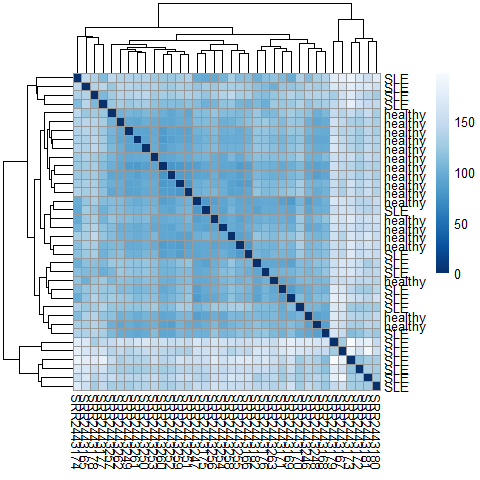
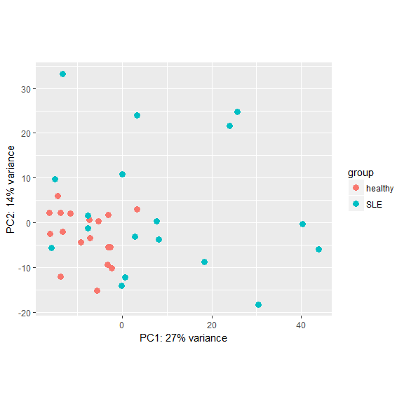
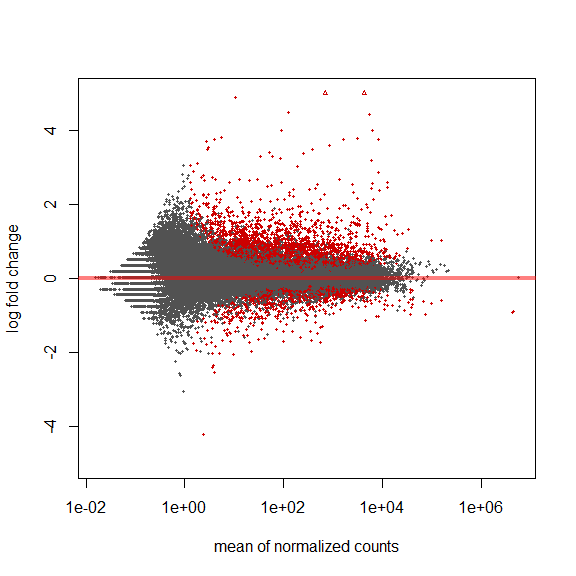
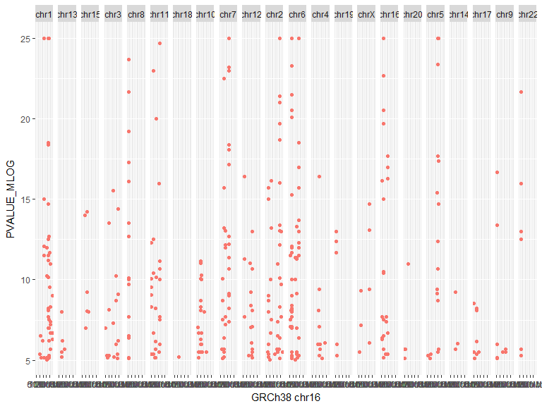
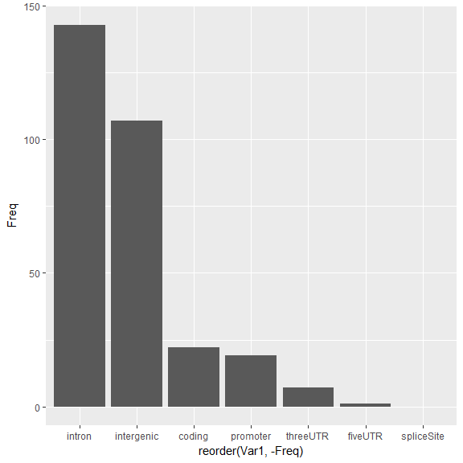

Bioconductor Regulatory Genomics Workflow
================
true

Introduction
============

Discovering and bringing new drugs to the market is a long, expensive and inefficient process \[1, 2\]. Increasing the success rates of drug discovery programmes would be transformative to the pharmaceutical industry and significantly improve patients’ access to medicines. Of note, the majority of drug discovery programmes fail for efficacy reasons \[3\], with up to 40% of these failures due to lack of a clear link between the target and the disease under investigation \[4\].

Target selection, the first step in drug discovery programmes, is thus a critical decision point. It has previously been shown that therapeutic targets with a genetic link to the disease under investigation are more likely to progress through the drug discovery pipeline, suggesting that genetics can be used as a tool to prioritise and validate drug targets in early discovery \[5, 6\].

Over the last decade, genome-wide association studies (GWASs) have revolutionised the field of human genetics allowing to survey DNA mutations associated with disease and other complex traits on an unprecedented scale \[7\]. Similarly, phenome-wide association studies (PheWAS) are emerging as a complementary methodology to decipher the genetic bases of the human phenome \[8\]. While many of these associations might not actually be relevant for the disease aetiology \[9\], these methods hold much promise to guide pharmaceutical scientists towards the next generation of drug targets \[10\].

Arguably, one of the biggest challenges in translating findings from GWASs to therapies is that the great majority of single nucleotide polymorphisms (SNPs) associated with disease are found in non-coding regions of the genome and therefore cannot be easily linked to a target gene \[11\]. Many of these SNPs could be regulatory variants, affecting the expression of nearby or distal genes by interfering with the process of transcription (e.g.: binding of transcription factors at promoters or enhancers) \[12\].

The most established way to map disease-associated regulatory variants to target genes is probably to use expression quantitative trait loci (eQTLs) \[13\], variants that affect the expression of specific genes. Over the last few years, the GTEx consortium assembled a valuable resource by performing large-scale mapping of genome-wide correlations between genetic variants and gene expression across 44 human tissues \[14\].

However, depending on the power of the study, it might not be possible to detect all existing regulatory variants as eQTLs. An alternative is to use information on the location of promoters and distal enhancers across the genome and link these regulatory elements to their target genes. Large, multi-centre Initiatives such as ENCODE \[15\], Roadmap Epigenomics \[16\] and BLUEPRINT \[17, 18\] mapped regulatory elements in the genome by profiling a number of chromatin features including DNase hypersensitive sites (DHSs), several types of histone marks and binding of chromatin-associated proteins in a large number of cell lines, primary cell types and tissues. Similarly, the FANTOM consortium used cap analysis of gene expression (CAGE) to identify promoters and enhancers across hundreds of cells and tissues \[19\].

Knowing that a certain stretch of DNA is an enhancer is however not informative of the target gene(s). One way to infer links between enhancers and promoters *in silico* is to identify significant correlations across a large panel of cell types, an approach that was used for distal and promoter DHSs \[20\] as well as for CAGE-defined promoters and enhancers \[21\]. Experimental methods to assay interactions between regulatory elements also exist. Chromatin interaction analysis by paired-end tag sequencing (ChIA-PET) \[22, 23\] couples chromatin immunoprecipitation with DNA ligation and sequencing to identify regions of DNA that are interacting thanks to the binding of a specific protein. Promoter capture Hi-C \[24, 25\] extends chromatin conformation capture by using "baits" to enrich for promoter interactions and increase resolution.

Overall, linking genetic variants to their candidate target genes is not straightforward, not only because of the complexity of the human genome and transcriptional regulation, but also because of the variety of data types and approaches that can be used. To address this, we developed STOPGAP (systematic target opportunity assessment by genetic association predictions), a database of disease variants mapped to their most likely target gene(s) using different types of regulatory genomic data \[26\]. The database is currently undergoing a major overhaul and will eventually be superseded by POSTGAP \[27\]. A similar resource and valid alternative is INFERNO (inferring the molecular mechanisms of noncoding variants) \[28\].

Workflow
========

Overview
--------

In this workflow we will explore how regulatory genomic data can be used to connect the genetic and transcriptional layers by providing a framework for the functional annotation of SNPs from GWASs. We will use eQTL data from GTEx \[14\], FANTOM5 correlations between promoters and enhancers \[21\] and promoter capture Hi-C data \[Javierre2016\].

We start with a common scenario: we run a RNA-seq experiment comparing patients with a disease and healthy individuals, and would like to discover key disease genes and potential therapeutic targets by integrating genetic information in our analysis.

Install required packages
-------------------------

R version 3.4.2 and Bioconductor version 3.6 were used for the analysis. The code below will install all required packages and dependencies from Bioconductor and CRAN:

``` r
source("https://bioconductor.org/biocLite.R")
# uncomment the following line to install packages
#biocLite(c("DESeq2", "GenomicFeatures", "GenomicRanges", "ggplot2", "gwascat", "recount", "pheatmap", "RColorBrewer", "rtracklayer", "R.utils", "splitstackshape", "VariantAnnotation"))
```

Gene expression data and differential gene expression analysis
--------------------------------------------------------------

The RNA-seq data we will be using comes from blood of patients with systemic lupus erythematosus (SLE) and healthy controls \[29\].

We are going to use `recount` \[30\] to obtain gene-level counts:

``` r
library(recount)
# uncomment the following line to download dataset
#download_study("SRP062966")
load(file.path("SRP062966", "rse_gene.RData"))
rse <- scale_counts(rse_gene)
rse
```

    ## class: RangedSummarizedExperiment 
    ## dim: 58037 117 
    ## metadata(0):
    ## assays(1): counts
    ## rownames(58037): ENSG00000000003.14 ENSG00000000005.5 ...
    ##   ENSG00000283698.1 ENSG00000283699.1
    ## rowData names(3): gene_id bp_length symbol
    ## colnames(117): SRR2443263 SRR2443262 ... SRR2443147 SRR2443149
    ## colData names(21): project sample ... title characteristics

Other Bioconductor packages that can be used to access data from gene expression experiments directly in R are `GEOquery` \[31\] and `ArrayExpress` \[32\].

So, we have 117 samples. This is what the data looks like:

``` r
assay(rse)[1:10, 1:10]
```

    ##                    SRR2443263 SRR2443262 SRR2443261 SRR2443260 SRR2443259
    ## ENSG00000000003.14         19          6         10         10          8
    ## ENSG00000000005.5           0          0          0          0          0
    ## ENSG00000000419.12        489        238        224        323        281
    ## ENSG00000000457.13        594        503        530        670        775
    ## ENSG00000000460.16        232        173        166        252        268
    ## ENSG00000000938.12      21554      18918      14260      19869      26586
    ## ENSG00000000971.15         94         57         45         59         35
    ## ENSG00000001036.13        500        397        358        407        500
    ## ENSG00000001084.10        373        298        336        367        391
    ## ENSG00000001167.14        827        832        837       1091       1013
    ##                    SRR2443258 SRR2443257 SRR2443256 SRR2443255 SRR2443254
    ## ENSG00000000003.14          6          2         24         21         11
    ## ENSG00000000005.5           0          0          0          0          0
    ## ENSG00000000419.12        333        214        390        270        359
    ## ENSG00000000457.13        712        461        603        613        609
    ## ENSG00000000460.16        263        160        228        245        234
    ## ENSG00000000938.12      17377      19981      15136      13039      16994
    ## ENSG00000000971.15         76         26         53         60         50
    ## ENSG00000001036.13        714        364        575        438        638
    ## ENSG00000001084.10        535        326        581        438        418
    ## ENSG00000001167.14        967        737        874        886        902

We note that genes are annotated using the GENCODE \[33\] v25 annotation, which will be useful later on. Let's look at the metadata to check how we can split samples between cases and controls:

``` r
colData(rse)
```

    ## DataFrame with 117 rows and 21 columns
    ##                project      sample  experiment         run
    ##            <character> <character> <character> <character>
    ## SRR2443263   SRP062966  SRS1048033  SRX1168388  SRR2443263
    ## SRR2443262   SRP062966  SRS1048034  SRX1168387  SRR2443262
    ## SRR2443261   SRP062966  SRS1048035  SRX1168386  SRR2443261
    ## SRR2443260   SRP062966  SRS1048036  SRX1168385  SRR2443260
    ## SRR2443259   SRP062966  SRS1048037  SRX1168384  SRR2443259
    ## ...                ...         ...         ...         ...
    ## SRR2443151   SRP062966  SRS1048145  SRX1168276  SRR2443151
    ## SRR2443150   SRP062966  SRS1048146  SRX1168275  SRR2443150
    ## SRR2443148   SRP062966  SRS1048147  SRX1168273  SRR2443148
    ## SRR2443147   SRP062966  SRS1048148  SRX1168272  SRR2443147
    ## SRR2443149   SRP062966  SRS1048149  SRX1168274  SRR2443149
    ##            read_count_as_reported_by_sra reads_downloaded
    ##                                <integer>        <integer>
    ## SRR2443263                     103977424        103977424
    ## SRR2443262                     125900891        125900891
    ## SRR2443261                     129803063        129803063
    ## SRR2443260                     105335395        105335395
    ## SRR2443259                     101692332        101692332
    ## ...                                  ...              ...
    ## SRR2443151                      87315854         87315854
    ## SRR2443150                      96825506         96825506
    ## SRR2443148                     121365435        121365435
    ## SRR2443147                     104038425        104038425
    ## SRR2443149                     113083096        113083096
    ##            proportion_of_reads_reported_by_sra_downloaded paired_end
    ##                                                 <numeric>  <logical>
    ## SRR2443263                                              1      FALSE
    ## SRR2443262                                              1      FALSE
    ## SRR2443261                                              1      FALSE
    ## SRR2443260                                              1      FALSE
    ## SRR2443259                                              1      FALSE
    ## ...                                                   ...        ...
    ## SRR2443151                                              1      FALSE
    ## SRR2443150                                              1      FALSE
    ## SRR2443148                                              1      FALSE
    ## SRR2443147                                              1      FALSE
    ## SRR2443149                                              1      FALSE
    ##            sra_misreported_paired_end mapped_read_count        auc
    ##                             <logical>         <integer>  <numeric>
    ## SRR2443263                      FALSE         103499268 5149333280
    ## SRR2443262                      FALSE         125499809 6244059473
    ## SRR2443261                      FALSE         125043355 6201504759
    ## SRR2443260                      FALSE         104872856 5211910530
    ## SRR2443259                      FALSE         101258496 5033612693
    ## ...                               ...               ...        ...
    ## SRR2443151                      FALSE          86874384 4319264868
    ## SRR2443150                      FALSE          96316303 4787601223
    ## SRR2443148                      FALSE         120819733 6009515064
    ## SRR2443147                      FALSE         103588909 5153702232
    ## SRR2443149                      FALSE         112640054 5598306153
    ##            sharq_beta_tissue sharq_beta_cell_type
    ##                  <character>          <character>
    ## SRR2443263                NA                   NA
    ## SRR2443262                NA                   NA
    ## SRR2443261                NA                   NA
    ## SRR2443260                NA                   NA
    ## SRR2443259                NA                   NA
    ## ...                      ...                  ...
    ## SRR2443151                NA                   NA
    ## SRR2443150                NA                   NA
    ## SRR2443148                NA                   NA
    ## SRR2443147                NA                   NA
    ## SRR2443149                NA                   NA
    ##            biosample_submission_date biosample_publication_date
    ##                          <character>                <character>
    ## SRR2443263   2015-08-28T16:41:29.000    2015-09-16T01:24:17.350
    ## SRR2443262   2015-08-28T16:41:28.000    2015-09-16T01:24:16.410
    ## SRR2443261   2015-08-28T16:41:27.000    2015-09-16T01:24:14.823
    ## SRR2443260   2015-08-28T16:41:35.000    2015-09-16T01:24:13.450
    ## SRR2443259   2015-08-28T16:41:33.000    2015-09-16T01:24:12.433
    ## ...                              ...                        ...
    ## SRR2443151   2015-08-28T16:42:24.000    2015-09-16T01:19:06.787
    ## SRR2443150   2015-08-28T16:42:23.000    2015-09-16T01:19:05.557
    ## SRR2443148   2015-08-28T16:42:21.000    2015-09-16T01:20:16.080
    ## SRR2443147   2015-08-28T16:42:19.000    2015-09-16T01:20:14.923
    ## SRR2443149   2015-08-28T16:42:22.000    2015-09-16T01:19:04.583
    ##              biosample_update_date avg_read_length geo_accession
    ##                        <character>       <integer>   <character>
    ## SRR2443263 2015-09-16T01:28:05.297              50    GSM1863749
    ## SRR2443262 2015-09-16T01:28:05.027              50    GSM1863748
    ## SRR2443261 2015-09-16T01:28:04.803              50    GSM1863747
    ## SRR2443260 2015-09-16T01:28:04.587              50    GSM1863746
    ## SRR2443259 2015-09-16T01:28:04.347              50    GSM1863745
    ## ...                            ...             ...           ...
    ## SRR2443151 2015-09-16T01:23:41.897              50    GSM1863637
    ## SRR2443150 2015-09-16T01:23:41.453              50    GSM1863636
    ## SRR2443148 2015-09-16T01:23:41.093              50    GSM1863634
    ## SRR2443147 2015-09-16T01:23:40.840              50    GSM1863633
    ## SRR2443149 2015-09-16T01:23:40.597              50    GSM1863635
    ##              bigwig_file       title
    ##              <character> <character>
    ## SRR2443263 SRR2443263.bw   control18
    ## SRR2443262 SRR2443262.bw   control17
    ## SRR2443261 SRR2443261.bw   control16
    ## SRR2443260 SRR2443260.bw   control15
    ## SRR2443259 SRR2443259.bw   control14
    ## ...                  ...         ...
    ## SRR2443151 SRR2443151.bw        SLE5
    ## SRR2443150 SRR2443150.bw        SLE4
    ## SRR2443148 SRR2443148.bw        SLE2
    ## SRR2443147 SRR2443147.bw        SLE1
    ## SRR2443149 SRR2443149.bw        SLE3
    ##                                                                                     characteristics
    ##                                                                                     <CharacterList>
    ## SRR2443263                         disease status: healthy,tissue: whole blood,anti-ro: control,...
    ## SRR2443262                         disease status: healthy,tissue: whole blood,anti-ro: control,...
    ## SRR2443261                         disease status: healthy,tissue: whole blood,anti-ro: control,...
    ## SRR2443260                         disease status: healthy,tissue: whole blood,anti-ro: control,...
    ## SRR2443259                         disease status: healthy,tissue: whole blood,anti-ro: control,...
    ## ...                                                                                             ...
    ## SRR2443151  disease status: systemic lupus erythematosus (SLE),tissue: whole blood,anti-ro: med,...
    ## SRR2443150 disease status: systemic lupus erythematosus (SLE),tissue: whole blood,anti-ro: high,...
    ## SRR2443148 disease status: systemic lupus erythematosus (SLE),tissue: whole blood,anti-ro: high,...
    ## SRR2443147 disease status: systemic lupus erythematosus (SLE),tissue: whole blood,anti-ro: high,...
    ## SRR2443149 disease status: systemic lupus erythematosus (SLE),tissue: whole blood,anti-ro: high,...

The most interesting part of the metadata is contained in the `characteristics` column, which is a `CharacterList` object:

``` r
colData(rse)$characteristics
```

    ## CharacterList of length 117
    ## [[1]] disease status: healthy tissue: whole blood anti-ro: control ism: control
    ## [[2]] disease status: healthy tissue: whole blood anti-ro: control ism: control
    ## [[3]] disease status: healthy tissue: whole blood anti-ro: control ism: control
    ## [[4]] disease status: healthy tissue: whole blood anti-ro: control ism: control
    ## [[5]] disease status: healthy tissue: whole blood anti-ro: control ism: control
    ## [[6]] disease status: healthy tissue: whole blood anti-ro: control ism: control
    ## [[7]] disease status: healthy tissue: whole blood anti-ro: control ism: control
    ## [[8]] disease status: healthy tissue: whole blood anti-ro: control ism: control
    ## [[9]] disease status: healthy tissue: whole blood anti-ro: control ism: control
    ## [[10]] disease status: healthy tissue: whole blood anti-ro: control ism: control
    ## ...
    ## <107 more elements>

Let's create some new columns with this information that can be used for the differential expression analysis. We will also make sure that they are encoded as factors and that the correct reference layer is used:

``` r
# disease status
colData(rse)$disease_status <- sapply(colData(rse)$characteristics, "[", 1)
colData(rse)$disease_status <- sub("disease status: ", "", colData(rse)$disease_status)
colData(rse)$disease_status <- sub("systemic lupus erythematosus \\(SLE\\)", "SLE", colData(rse)$disease_status)
colData(rse)$disease_status <- factor(colData(rse)$disease_status, levels = c("healthy", "SLE"))
# tissue
colData(rse)$tissue <- sapply(colData(rse)$characteristics, "[", 2)
colData(rse)$tissue <- sub("tissue: ", "", colData(rse)$tissue)
colData(rse)$tissue <- factor(colData(rse)$tissue)
# anti-ro
colData(rse)$anti_ro <- sapply(colData(rse)$characteristics, "[", 3)
colData(rse)$anti_ro <- sub("anti-ro: ", "", colData(rse)$anti_ro)
colData(rse)$anti_ro <- factor(colData(rse)$anti_ro)
# ism
colData(rse)$ism <- sapply(colData(rse)$characteristics, "[", 4)
colData(rse)$ism <-sub("ism: ", "", colData(rse)$ism)
colData(rse)$ism <- factor(colData(rse)$ism)
```

We can have a look at the new format:

``` r
colData(rse)[c("disease_status", "tissue", "anti_ro", "ism")]
```

    ## DataFrame with 117 rows and 4 columns
    ##            disease_status      tissue  anti_ro      ism
    ##                  <factor>    <factor> <factor> <factor>
    ## SRR2443263        healthy whole blood  control  control
    ## SRR2443262        healthy whole blood  control  control
    ## SRR2443261        healthy whole blood  control  control
    ## SRR2443260        healthy whole blood  control  control
    ## SRR2443259        healthy whole blood  control  control
    ## ...                   ...         ...      ...      ...
    ## SRR2443151            SLE whole blood      med  ISM_low
    ## SRR2443150            SLE whole blood     high  ISM_low
    ## SRR2443148            SLE whole blood     high ISM_high
    ## SRR2443147            SLE whole blood     high ISM_high
    ## SRR2443149            SLE whole blood     high ISM_high

It looks more readable. Let's now check how many samples we have in each group:

``` r
table(colData(rse)$disease_status)
```

    ## 
    ## healthy     SLE 
    ##      18      99

To speed up code execution we will limit the number of SLE samples. For simplicity, we select the first 18 (healthy) and the last 18 (SLE) samples from the original `RangedSummarizedExperiment` object:

``` r
rse <- rse[, c(1:18, 82:99)]
```

Now we are ready to perform a simple differential gene expression analysis with `DESeq2` \[34\]:

``` r
library(DESeq2)
dds <- DESeqDataSet(rse, ~ disease_status)
dds <- DESeq(dds)
dds
```

    ## class: DESeqDataSet 
    ## dim: 58037 36 
    ## metadata(1): version
    ## assays(5): counts mu cooks replaceCounts replaceCooks
    ## rownames(58037): ENSG00000000003.14 ENSG00000000005.5 ...
    ##   ENSG00000283698.1 ENSG00000283699.1
    ## rowData names(25): gene_id bp_length ... maxCooks replace
    ## colnames(36): SRR2443263 SRR2443262 ... SRR2443166 SRR2443165
    ## colData names(27): project sample ... sizeFactor replaceable

Note that we used an extremely simple model; in the real world you will probably need to account for co-variables, potential confounders and interactions between them. `edgeR` \[35\] and `limma` \[36\] are good alternatives to `DESEq2` for performing differential expression analyses.

We can now look at the data in more detail. We use the variance stabilising transformation (VST) \[37\] for visualisation purposes:

``` r
vsd <- vst(dds, blind = FALSE)
```

First, let's look at distances between samples to see if we can recover a separation between SLE and healthy samples:

``` r
sampleDists <- as.matrix(dist(t(assay(vsd))))
rownames(sampleDists) <- vsd$disease_status
sampleDists[c(1, 18, 19, 36), c(1, 18, 19, 36)]
```

    ##         SRR2443263 SRR2443248 SRR2443182 SRR2443165
    ## healthy    0.00000   106.6933   93.30292   99.84061
    ## healthy  106.69330     0.0000  115.87958  127.27997
    ## SLE       93.30292   115.8796    0.00000  115.06568
    ## SLE       99.84061   127.2800  115.06568    0.00000

We will use the `pheatmap` \[38\] and `RColorBrewer` \[39\] packages for drawing the heatmap (Figure @ref(fig:heatmap)):

``` r
library(pheatmap)
library(RColorBrewer)
colors <- colorRampPalette(rev(brewer.pal(9, "Blues")))(255)
pheatmap(sampleDists, col = colors)
```



Similarly, we can perform a principal component analysis (PCA) on the most variable 500 genes (Figure @ref(fig:pca)):

``` r
plotPCA(vsd, intgroup = "disease_status")
```



This looks better, we can see some separation of healthy and SLE samples along both PC1 and PC2, though some SLE samples appear very similar to the healthy ones. Next, we select genes that are differentially expressed below a 0.05 adjusted p-value threshold:

``` r
res <- results(dds, alpha = 0.05)
res
```

    ## log2 fold change (MLE): disease status SLE vs healthy 
    ## Wald test p-value: disease status SLE vs healthy 
    ## DataFrame with 58037 rows and 6 columns
    ##                       baseMean log2FoldChange      lfcSE         stat
    ##                      <numeric>      <numeric>  <numeric>    <numeric>
    ## ENSG00000000003.14  10.4189981    -0.20051804 0.24868451  -0.80631496
    ## ENSG00000000005.5    0.0317823     0.03330732 2.96442394   0.01123568
    ## ENSG00000000419.12 389.9025130     0.66288230 0.11427371   5.80082925
    ## ENSG00000000457.13 636.6928414     0.17336365 0.08062862   2.15015047
    ## ENSG00000000460.16 234.6479796     0.20589404 0.07445624   2.76530274
    ## ...                        ...            ...        ...          ...
    ## ENSG00000283695.1    0.0000000             NA         NA           NA
    ## ENSG00000283696.1   19.1311904    0.252144173  0.1545613  1.631353425
    ## ENSG00000283697.1   14.9180870    0.179070242  0.1522931  1.175826692
    ## ENSG00000283698.1    0.2289885    0.021962044  1.1315739  0.019408404
    ## ENSG00000283699.1    0.5398951   -0.003056215  0.7578201 -0.004032903
    ##                          pvalue         padj
    ##                       <numeric>    <numeric>
    ## ENSG00000000003.14 4.200613e-01 6.706002e-01
    ## ENSG00000000005.5  9.910354e-01           NA
    ## ENSG00000000419.12 6.598777e-09 3.058479e-06
    ## ENSG00000000457.13 3.154331e-02 1.463634e-01
    ## ENSG00000000460.16 5.686999e-03 4.643041e-02
    ## ...                         ...          ...
    ## ENSG00000283695.1            NA           NA
    ## ENSG00000283696.1     0.1028158    0.3075119
    ## ENSG00000283697.1     0.2396641    0.4987872
    ## ENSG00000283698.1     0.9845153           NA
    ## ENSG00000283699.1     0.9967822           NA

We can look at a summary of the results:

``` r
summary(res)
```

    ## 
    ## out of 43005 with nonzero total read count
    ## adjusted p-value < 0.05
    ## LFC > 0 (up)     : 2526, 5.9% 
    ## LFC < 0 (down)   : 1069, 2.5% 
    ## outliers [1]     : 0, 0% 
    ## low counts [2]   : 14735, 34% 
    ## (mean count < 1)
    ## [1] see 'cooksCutoff' argument of ?results
    ## [2] see 'independentFiltering' argument of ?results

We can also visualise the log fold changes using an MA plot (Figure @ref(fig:maplot)):

``` r
plotMA(res, ylim = c(-5,5))
```



For convenience, we will save our differentially expressed genes (DEGs) in another object:

``` r
degs <- subset(res, padj < 0.05)
degs <- as.data.frame(degs)
head(degs)
```

    ##                      baseMean log2FoldChange      lfcSE      stat
    ## ENSG00000000419.12  389.90251      0.6628823 0.11427371  5.800829
    ## ENSG00000000460.16  234.64798      0.2058940 0.07445624  2.765303
    ## ENSG00000002549.12 1970.95648      0.8657769 0.25181202  3.438187
    ## ENSG00000003096.13   11.18475     -0.7894018 0.25613621 -3.081961
    ## ENSG00000003147.17   71.79432      0.6113739 0.15162606  4.032116
    ## ENSG00000003249.13  119.18587     -0.8520562 0.27061961 -3.148538
    ##                          pvalue         padj
    ## ENSG00000000419.12 6.598777e-09 3.058479e-06
    ## ENSG00000000460.16 5.686999e-03 4.643041e-02
    ## ENSG00000002549.12 5.856225e-04 9.776328e-03
    ## ENSG00000003096.13 2.056419e-03 2.291728e-02
    ## ENSG00000003147.17 5.527679e-05 1.927054e-03
    ## ENSG00000003249.13 1.640893e-03 1.955034e-02

We also map the GENCODE gene IDs to gene symbols using the annotation in the original `RangedSummarizedExperiment` object, which is going to be convenient later on:

``` r
rowData(rse)
```

    ## DataFrame with 58037 rows and 3 columns
    ##                  gene_id bp_length          symbol
    ##              <character> <integer> <CharacterList>
    ## 1     ENSG00000000003.14      4535          TSPAN6
    ## 2      ENSG00000000005.5      1610            TNMD
    ## 3     ENSG00000000419.12      1207            DPM1
    ## 4     ENSG00000000457.13      6883           SCYL3
    ## 5     ENSG00000000460.16      5967        C1orf112
    ## ...                  ...       ...             ...
    ## 58033  ENSG00000283695.1        61              NA
    ## 58034  ENSG00000283696.1       997              NA
    ## 58035  ENSG00000283697.1      1184    LOC101928917
    ## 58036  ENSG00000283698.1       940              NA
    ## 58037  ENSG00000283699.1        60         MIR4481

``` r
degs <- merge(rowData(rse), degs, by.x = "gene_id", by.y = "row.names", all = FALSE)
tail(degs)
```

    ## DataFrame with 6 rows and 9 columns
    ##                   gene_id bp_length symbol   baseMean log2FoldChange
    ##               <character> <integer> <list>  <numeric>      <numeric>
    ## [3590,] ENSG00000283444.1       831     NA   2.756993      1.3404014
    ## [3591,] ENSG00000283479.1       420     NA   1.928773      1.9512651
    ## [3592,] ENSG00000283485.1      2190   ASPH 277.956104      1.3415229
    ## [3593,] ENSG00000283571.1       306     NA   1.791920      1.8502738
    ## [3594,] ENSG00000283602.1      2089     NA 130.233552      0.5752086
    ## [3595,] ENSG00000283623.1       594   ATG5 107.731105      0.4144398
    ##             lfcSE      stat       pvalue        padj
    ##         <numeric> <numeric>    <numeric>   <numeric>
    ## [3590,] 0.4729127  2.834353 0.0045918633 0.040127193
    ## [3591,] 0.5681341  3.434515 0.0005936154 0.009822205
    ## [3592,] 0.3694185  3.631445 0.0002818390 0.005898176
    ## [3593,] 0.6557494  2.821617 0.0047782147 0.041137170
    ## [3594,] 0.2047652  2.809112 0.0049678327 0.042178839
    ## [3595,] 0.1066472  3.886081 0.0001018754 0.002951150

Accessing GWAS data
-------------------

We have more than 3500 genes of interest at this stage. Since we know that therapeutic targets with genetic evidence are more likely to progress through the drug discovery pipeline \[6\], one way to prioritise them could be to check which of these can be genetically linked to SLE. To get hold of relevant GWAS data, we will be using the `gwascat` Bioconductor package \[40\], which provides an interface to the GWAS catalog \[41\]. An alternative is to use the GRASP \[42\] database with the `grasp2db` \[43\] package.

``` r
library(gwascat)
# uncomment the following line to download file and build the gwasloc object all in one step
#snps <- makeCurrentGwascat()
# uncomment the following line to download file
#download.file("http://www.ebi.ac.uk/gwas/api/search/downloads/alternative", destfile = "gwas_catalog_v1.0.1-associations_e90_r2017-12-04.tsv")
snps <- read.delim("gwas_catalog_v1.0.1-associations_e90_r2017-12-04.tsv", check.names = FALSE, stringsAsFactors = FALSE)
snps <- gwascat:::gwdf2GRanges(snps, extractDate = "2017-12-04")
genome(snps) <- "GRCh38"
snps
```

    ## gwasloc instance with 61107 records and 37 attributes per record.
    ## Extracted:  2017-12-04 
    ## Genome:  GRCh38 
    ## Excerpt:
    ## GRanges object with 5 ranges and 3 metadata columns:
    ##       seqnames                 ranges strand | DISEASE/TRAIT        SNPS
    ##          <Rle>              <IRanges>  <Rle> |   <character> <character>
    ##   [1]     chr1 [203186754, 203186754]      * | YKL-40 levels   rs4950928
    ##   [2]    chr13 [ 39776775,  39776775]      * |     Psoriasis   rs7993214
    ##   [3]    chr15 [ 78513681,  78513681]      * |   Lung cancer   rs8034191
    ##   [4]     chr1 [159711078, 159711078]      * |   Lung cancer   rs2808630
    ##   [5]     chr3 [190632672, 190632672]      * |   Lung cancer   rs7626795
    ##         P-VALUE
    ##       <numeric>
    ##   [1]     1e-13
    ##   [2]     2e-06
    ##   [3]     3e-18
    ##   [4]     7e-06
    ##   [5]     8e-06
    ##   -------
    ##   seqinfo: 23 sequences from GRCh38 genome; no seqlengths

SNPs is a `gwasloc` object which is simply a wrapper around a `GRanges` object, the standard way to express genomic ranges in Bioconductor. We are interested in SNPs associated with SLE:

``` r
snps <- subsetByTraits(snps, tr = "Systemic lupus erythematosus")
snps
```

    ## gwasloc instance with 402 records and 37 attributes per record.
    ## Extracted:  2017-12-04 
    ## Genome:  GRCh38 
    ## Excerpt:
    ## GRanges object with 5 ranges and 3 metadata columns:
    ##       seqnames                 ranges strand |
    ##          <Rle>              <IRanges>  <Rle> |
    ##   [1]    chr16 [ 31301932,  31301932]      * |
    ##   [2]    chr11 [   589564,    589564]      * |
    ##   [3]     chr3 [ 58384450,  58384450]      * |
    ##   [4]     chr1 [173340574, 173340574]      * |
    ##   [5]     chr8 [ 11491677,  11491677]      * |
    ##                      DISEASE/TRAIT        SNPS   P-VALUE
    ##                        <character> <character> <numeric>
    ##   [1] Systemic lupus erythematosus   rs9888739     2e-23
    ##   [2] Systemic lupus erythematosus   rs4963128     3e-10
    ##   [3] Systemic lupus erythematosus   rs6445975     7e-09
    ##   [4] Systemic lupus erythematosus  rs10798269     1e-07
    ##   [5] Systemic lupus erythematosus  rs13277113     1e-10
    ##   -------
    ##   seqinfo: 23 sequences from GRCh38 genome; no seqlengths

We can visualise these as a Manhattan plot to look at the distribution of GWAS p-values over chromosomes on a negative log scale (Figure @ref(fig:manhattan)). Note that p-values lower than 1e-25 are truncated in the figure and that we have to load `ggplot2` \[44\] to modify the look of the plot:

``` r
library(ggplot2)
traitsManh(gwr = snps, sel = snps, traits = "Systemic lupus erythematosus") +
  theme(legend.position = "none",
        axis.title.x = element_blank(),
        axis.text.x = element_blank())
```



We note here that genotyping arrays typically include a very small fraction of all possible SNPs in the human genome, and there is no guarantee that the *tag* SNPs on the array are the true casual SNPs \[45\]. The alleles of other SNPs can be imputed from tag SNPs thanks to the structure of linkage disequilibrium (LD) blocks present in chromosomes. Thus, when linking variants to target genes in a real-world setting, it is important to take into consideration neighbouring SNPs that are in high LD and inherited with the tag SNPs. For simplicity, we will skip this LD expansion step and refer the reader to the Ensembl REST API \[46, 47\], the Ensembl Linkage Disequilibrium Calculator \[48\] and the Bioconductor packages `trio` \[49\] and `ldblock` \[50\] to perform this task.

Annotation of coding and proximal SNPs to target genes
------------------------------------------------------

In order to annotate these variants, we need a a `TxDb` object, a reference of where transcripts are located on the genome. We can build this using the `GenomicFeatutres` \[51\] package and the GENCODE v25 gene annotation:

``` r
library(GenomicFeatures)
# uncomment the following line to download file
#download.file("ftp://ftp.sanger.ac.uk/pub/gencode/Gencode_human/release_25/gencode.v25.annotation.gff3.gz", destfile = "gencode.v25.annotation.gff3.gz")
txdb <- makeTxDbFromGFF("gencode.v25.annotation.gff3.gz")
txdb <- keepStandardChromosomes(txdb)
txdb
```

    ## TxDb object:
    ## # Db type: TxDb
    ## # Supporting package: GenomicFeatures
    ## # Data source: gencode.v25.annotation.gff3.gz
    ## # Organism: NA
    ## # Taxonomy ID: NA
    ## # miRBase build ID: NA
    ## # Genome: NA
    ## # transcript_nrow: 198093
    ## # exon_nrow: 1182765
    ## # cds_nrow: 704859
    ## # Db created by: GenomicFeatures package from Bioconductor
    ## # Creation time: 2018-01-10 11:53:54 +0000 (Wed, 10 Jan 2018)
    ## # GenomicFeatures version at creation time: 1.30.0
    ## # RSQLite version at creation time: 2.0
    ## # DBSCHEMAVERSION: 1.2

We also have to convert the `gwasloc` object into a standard `GRanges` object:

``` r
snps <- GRanges(snps)
```

Let's check if the `gwasloc` and `TxDb` object use the same notation for chromosomes:

``` r
seqlevelsStyle(snps)
```

    ## [1] "UCSC"

``` r
seqlevels(snps)
```

    ##  [1] "chr1"  "chr13" "chr15" "chr3"  "chr8"  "chr11" "chr18" "chr10"
    ##  [9] "chr7"  "chr12" "chr2"  "chr6"  "chr4"  "chr19" "chrX"  "chr16"
    ## [17] "chr20" "chr5"  "chr14" "chr17" "chr21" "chr9"  "chr22"

``` r
seqlevelsStyle(txdb)
```

    ## [1] "UCSC"

``` r
seqlevels(txdb)
```

    ##  [1] "chr1"  "chr2"  "chr3"  "chr4"  "chr5"  "chr6"  "chr7"  "chr8" 
    ##  [9] "chr9"  "chr10" "chr11" "chr12" "chr13" "chr14" "chr15" "chr16"
    ## [17] "chr17" "chr18" "chr19" "chr20" "chr21" "chr22" "chrX"  "chrY" 
    ## [25] "chrM"

OK, they do. Now we can annotate our SNPs to genes using the `VariantAnnotation` \[52\] package:

``` r
library(VariantAnnotation)
snps_anno <- locateVariants(snps, txdb, AllVariants())
snps_anno <- unique(snps_anno)
snps_anno
```

    ## GRanges object with 299 ranges and 9 metadata columns:
    ##         seqnames                 ranges strand |   LOCATION  LOCSTART
    ##            <Rle>              <IRanges>  <Rle> |   <factor> <integer>
    ##     [1]    chr16 [ 31301932,  31301932]      + |     intron     40161
    ##     [2]    chr11 [   589564,    589564]      + |     intron     12531
    ##     [3]     chr3 [ 58384450,  58384450]      + |     intron     51074
    ##     [4]     chr1 [173340574, 173340574]      * | intergenic      <NA>
    ##     [5]     chr8 [ 11491677,  11491677]      * | intergenic      <NA>
    ##     ...      ...                    ...    ... .        ...       ...
    ##   [295]     chr6 [137874014, 137874014]      + |     intron      6162
    ##   [296]     chr6 [ 32619077,  32619077]      * | intergenic      <NA>
    ##   [297]     chr6 [137685367, 137685367]      + |     intron     11552
    ##   [298]     chrX [153924366, 153924366]      - |     intron      1770
    ##   [299]     chr5 [160459613, 160459613]      * | intergenic      <NA>
    ##            LOCEND   QUERYID        TXID         CDSID             GENEID
    ##         <integer> <integer> <character> <IntegerList>        <character>
    ##     [1]     40161         1      143788               ENSG00000169896.16
    ##     [2]     12531         2       99581               ENSG00000070047.11
    ##     [3]     51074         3       34101               ENSG00000168297.15
    ##     [4]      <NA>         4        <NA>                             <NA>
    ##     [5]      <NA>         5        <NA>                             <NA>
    ##     ...       ...       ...         ...           ...                ...
    ##   [295]      6162       393       64150               ENSG00000118503.14
    ##   [296]      <NA>       397        <NA>                             <NA>
    ##   [297]     11552       398       64145                ENSG00000230533.2
    ##   [298]      1770       399      196900               ENSG00000089820.15
    ##   [299]      <NA>       400        <NA>                             <NA>
    ##                                                            PRECEDEID
    ##                                                      <CharacterList>
    ##     [1]                                                             
    ##     [2]                                                             
    ##     [3]                                                             
    ##     [4]   ENSG00000076321.10,ENSG00000117592.8,ENSG00000117593.9,...
    ##     [5] ENSG00000079459.12,ENSG00000136573.12,ENSG00000136574.17,...
    ##     ...                                                          ...
    ##   [295]                                                             
    ##   [296] ENSG00000030110.12,ENSG00000112473.17,ENSG00000112511.17,...
    ##   [297]                                                             
    ##   [298]                                                             
    ##   [299]  ENSG00000118322.12,ENSG00000145864.12,ENSG00000253417.5,...
    ##                                                             FOLLOWID
    ##                                                      <CharacterList>
    ##     [1]                                                             
    ##     [2]                                                             
    ##     [3]                                                             
    ##     [4]  ENSG00000094975.13,ENSG00000117560.7,ENSG00000117586.10,...
    ##     [5]  ENSG00000104643.9,ENSG00000154316.15,ENSG00000154319.14,...
    ##     ...                                                          ...
    ##   [295]                                                             
    ##   [296] ENSG00000166278.14,ENSG00000168477.17,ENSG00000196126.10,...
    ##   [297]                                                             
    ##   [298]                                                             
    ##   [299]  ENSG00000113312.10,ENSG00000135083.14,ENSG00000145861.7,...
    ##   -------
    ##   seqinfo: 23 sequences from GRCh38 genome; no seqlengths

We lost all the metadata from the original `snps` object, but we can recover it using the `QUERYID` column in `snps_anno`. We will only keep the SNP IDs and GWAS p-values:

``` r
snps_metadata <- snps[snps_anno$QUERYID]
mcols(snps_anno) <- cbind(mcols(snps_metadata)[c("SNPS", "P-VALUE")], mcols(snps_anno))
snps_anno
```

    ## GRanges object with 299 ranges and 11 metadata columns:
    ##         seqnames                 ranges strand |        SNPS   P.VALUE
    ##            <Rle>              <IRanges>  <Rle> | <character> <numeric>
    ##     [1]    chr16 [ 31301932,  31301932]      + |   rs9888739     2e-23
    ##     [2]    chr11 [   589564,    589564]      + |   rs4963128     3e-10
    ##     [3]     chr3 [ 58384450,  58384450]      + |   rs6445975     7e-09
    ##     [4]     chr1 [173340574, 173340574]      * |  rs10798269     1e-07
    ##     [5]     chr8 [ 11491677,  11491677]      * |  rs13277113     1e-10
    ##     ...      ...                    ...    ... .         ...       ...
    ##   [295]     chr6 [137874014, 137874014]      + |   rs5029937     5e-13
    ##   [296]     chr6 [ 32619077,  32619077]      * |   rs9271366     1e-07
    ##   [297]     chr6 [137685367, 137685367]      + |   rs6920220     4e-07
    ##   [298]     chrX [153924366, 153924366]      - |   rs2269368     8e-07
    ##   [299]     chr5 [160459613, 160459613]      * |   rs2431099     2e-06
    ##           LOCATION  LOCSTART    LOCEND   QUERYID        TXID         CDSID
    ##           <factor> <integer> <integer> <integer> <character> <IntegerList>
    ##     [1]     intron     40161     40161         1      143788              
    ##     [2]     intron     12531     12531         2       99581              
    ##     [3]     intron     51074     51074         3       34101              
    ##     [4] intergenic      <NA>      <NA>         4        <NA>              
    ##     [5] intergenic      <NA>      <NA>         5        <NA>              
    ##     ...        ...       ...       ...       ...         ...           ...
    ##   [295]     intron      6162      6162       393       64150              
    ##   [296] intergenic      <NA>      <NA>       397        <NA>              
    ##   [297]     intron     11552     11552       398       64145              
    ##   [298]     intron      1770      1770       399      196900              
    ##   [299] intergenic      <NA>      <NA>       400        <NA>              
    ##                     GENEID
    ##                <character>
    ##     [1] ENSG00000169896.16
    ##     [2] ENSG00000070047.11
    ##     [3] ENSG00000168297.15
    ##     [4]               <NA>
    ##     [5]               <NA>
    ##     ...                ...
    ##   [295] ENSG00000118503.14
    ##   [296]               <NA>
    ##   [297]  ENSG00000230533.2
    ##   [298] ENSG00000089820.15
    ##   [299]               <NA>
    ##                                                            PRECEDEID
    ##                                                      <CharacterList>
    ##     [1]                                                             
    ##     [2]                                                             
    ##     [3]                                                             
    ##     [4]   ENSG00000076321.10,ENSG00000117592.8,ENSG00000117593.9,...
    ##     [5] ENSG00000079459.12,ENSG00000136573.12,ENSG00000136574.17,...
    ##     ...                                                          ...
    ##   [295]                                                             
    ##   [296] ENSG00000030110.12,ENSG00000112473.17,ENSG00000112511.17,...
    ##   [297]                                                             
    ##   [298]                                                             
    ##   [299]  ENSG00000118322.12,ENSG00000145864.12,ENSG00000253417.5,...
    ##                                                             FOLLOWID
    ##                                                      <CharacterList>
    ##     [1]                                                             
    ##     [2]                                                             
    ##     [3]                                                             
    ##     [4]  ENSG00000094975.13,ENSG00000117560.7,ENSG00000117586.10,...
    ##     [5]  ENSG00000104643.9,ENSG00000154316.15,ENSG00000154319.14,...
    ##     ...                                                          ...
    ##   [295]                                                             
    ##   [296] ENSG00000166278.14,ENSG00000168477.17,ENSG00000196126.10,...
    ##   [297]                                                             
    ##   [298]                                                             
    ##   [299]  ENSG00000113312.10,ENSG00000135083.14,ENSG00000145861.7,...
    ##   -------
    ##   seqinfo: 23 sequences from GRCh38 genome; no seqlengths

We can visualise where these SNPs are located with `ggplot2` \[44\] (Figure @ref(fig:barplot)):

``` r
loc <- data.frame(table(snps_anno$LOCATION))
ggplot(data = loc, aes(x = reorder(Var1, -Freq), y = Freq)) +
  geom_bar(stat="identity")
```



As expected \[11\], the great majority of SNPs are located within introns and in intergenic regions. For the moment, we will focus on SNPs that are either coding or in promoter and UTR regions, as these can be assigned to target genes rather unambiguously:

``` r
snps_easy <- subset(snps_anno, LOCATION == "coding" | LOCATION == "promoter" | LOCATION == "threeUTR" | LOCATION == "fiveUTR")
snps_easy <- as.data.frame(snps_easy)
head(snps_easy)
```

    ##   seqnames     start       end width strand       SNPS P.VALUE LOCATION
    ## 1     chr4 101829919 101829919     1      + rs10516487   4e-10   coding
    ## 2     chr7 128954129 128954129     1      - rs10488631   2e-11 promoter
    ## 3    chr11  55368743  55368743     1      +  rs7927370   7e-06   coding
    ## 4     chr6 137874929 137874929     1      +  rs2230926   1e-17   coding
    ## 5    chr11 118702810 118702810     1      +  rs4639966   1e-16 promoter
    ## 6    chr16  30624338  30624338     1      -  rs7186852   3e-07 promoter
    ##   LOCSTART LOCEND QUERYID   TXID        CDSID             GENEID PRECEDEID
    ## 1      137    137       7  46105 170258, .... ENSG00000153064.11          
    ## 2       NA     NA      23  77786               ENSG00000275106.1          
    ## 3      860    860      45 101610       370677  ENSG00000181958.3          
    ## 4      380    380      57  64150 232398, .... ENSG00000118503.14          
    ## 5       NA     NA      63 104974               ENSG00000255422.1          
    ## 6       NA     NA      68 148763              ENSG00000156853.12          
    ##   FOLLOWID
    ## 1         
    ## 2         
    ## 3         
    ## 4         
    ## 5         
    ## 6

Now we can check if any of the genes we found to be differentially expressed in SLE is also genetically associated with the disease:

``` r
snps_easy_in_degs <- merge(degs, snps_easy, by.x = "gene_id", by.y = "GENEID", all = FALSE)
snps_easy_in_degs
```

    ## DataFrame with 7 rows and 24 columns
    ##                            gene_id bp_length  symbol   baseMean
    ##                        <character> <integer>  <list>  <numeric>
    ## ENSG00000096968 ENSG00000096968.13      6170    JAK2 1279.47795
    ## ENSG00000099834 ENSG00000099834.18      3873   CDHR5   10.20177
    ## ENSG00000115267  ENSG00000115267.5      4528   IFIH1 1415.91330
    ## ENSG00000120280  ENSG00000120280.5      1855 CXorf21  637.78094
    ## ENSG00000185507 ENSG00000185507.19      2628    IRF7 4883.20891
    ## ENSG00000204366  ENSG00000204366.3      1875  ZBTB12   22.99200
    ## ENSG00000275106  ENSG00000275106.1       790      NA   10.32171
    ##                 log2FoldChange     lfcSE      stat       pvalue
    ##                      <numeric> <numeric> <numeric>    <numeric>
    ## ENSG00000096968      0.4854343 0.1553513  3.124753 1.779545e-03
    ## ENSG00000099834      0.8539586 0.2666557  3.202476 1.362516e-03
    ## ENSG00000115267      1.1494945 0.2729847  4.210838 2.544247e-05
    ## ENSG00000120280      0.7819504 0.1541707  5.071977 3.937038e-07
    ## ENSG00000185507      1.4062704 0.2992536  4.699260 2.611057e-06
    ## ENSG00000204366     -0.3892298 0.1348705 -2.885952 3.902318e-03
    ## ENSG00000275106      0.7344844 0.2305300  3.186068 1.442206e-03
    ##                         padj seqnames     start       end     width
    ##                    <numeric> <factor> <integer> <integer> <integer>
    ## ENSG00000096968 2.068794e-02     chr9   4984530   4984530         1
    ## ENSG00000099834 1.732902e-02    chr11    625085    625085         1
    ## ENSG00000115267 1.120363e-03     chr2 162267541 162267541         1
    ## ENSG00000120280 6.047898e-05     chrX  30559729  30559729         1
    ## ENSG00000185507 2.298336e-04    chr11    614318    614318         1
    ## ENSG00000204366 3.584479e-02     chr6  31902549  31902549         1
    ## ENSG00000275106 1.797861e-02     chr7 128954129 128954129         1
    ##                   strand        SNPS   P.VALUE LOCATION  LOCSTART
    ##                 <factor> <character> <numeric> <factor> <integer>
    ## ENSG00000096968        +   rs1887428     1e-06  fiveUTR       141
    ## ENSG00000099834        -  rs58688157     5e-13 promoter        NA
    ## ENSG00000115267        -   rs1990760     4e-08   coding      2836
    ## ENSG00000120280        -    rs887369     5e-10   coding       627
    ## ENSG00000185507        -   rs1061502     9e-11   coding       217
    ## ENSG00000204366        -    rs558702     8e-21 promoter        NA
    ## ENSG00000275106        -  rs10488631     2e-11 promoter        NA
    ##                    LOCEND   QUERYID        TXID                    CDSID
    ##                 <integer> <integer> <character>                   <list>
    ## ENSG00000096968       141       329       86536                         
    ## ENSG00000099834        NA       208      105793                         
    ## ENSG00000115267      2836       233       29219                   106867
    ## ENSG00000120280       627       192      194672                   692823
    ## ENSG00000185507       217       317      105777 385431,385427,385428,...
    ## ENSG00000204366        NA       116       65993                         
    ## ENSG00000275106        NA        23       77786                         
    ##                 PRECEDEID FOLLOWID
    ##                    <list>   <list>
    ## ENSG00000096968                   
    ## ENSG00000099834                   
    ## ENSG00000115267                   
    ## ENSG00000120280                   
    ## ENSG00000185507                   
    ## ENSG00000204366                   
    ## ENSG00000275106

So, we have 7 genes showing differential expression in SLE that are also genetically associated with the disease. While this is an interesting result, these hits are likely to be already well-known as potential SLE targets given their clear genetic association.

We will store essential information about these hits in a results `data.frame`:

``` r
prioritised_hits <- unique(data.frame(
  snp_id = snps_easy_in_degs$SNPS,
  snp_pvalue = snps_easy_in_degs$P.VALUE,
  snp_location = snps_easy_in_degs$LOCATION,
  gene_id = snps_easy_in_degs$gene_id,
  gene_symbol = snps_easy_in_degs$symbol,
  gene_pvalue = snps_easy_in_degs$padj,
  gene_log2foldchange = snps_easy_in_degs$log2FoldChange))
prioritised_hits
```

    ##                     snp_id snp_pvalue snp_location            gene_id
    ## ENSG00000096968  rs1887428      1e-06      fiveUTR ENSG00000096968.13
    ## ENSG00000099834 rs58688157      5e-13     promoter ENSG00000099834.18
    ## ENSG00000115267  rs1990760      4e-08       coding  ENSG00000115267.5
    ## ENSG00000120280   rs887369      5e-10       coding  ENSG00000120280.5
    ## ENSG00000185507  rs1061502      9e-11       coding ENSG00000185507.19
    ## ENSG00000204366   rs558702      8e-21     promoter  ENSG00000204366.3
    ## ENSG00000275106 rs10488631      2e-11     promoter  ENSG00000275106.1
    ##                 gene_symbol  gene_pvalue gene_log2foldchange
    ## ENSG00000096968        JAK2 2.068794e-02           0.4854343
    ## ENSG00000099834       CDHR5 1.732902e-02           0.8539586
    ## ENSG00000115267       IFIH1 1.120363e-03           1.1494945
    ## ENSG00000120280     CXorf21 6.047898e-05           0.7819504
    ## ENSG00000185507        IRF7 2.298336e-04           1.4062704
    ## ENSG00000204366      ZBTB12 3.584479e-02          -0.3892298
    ## ENSG00000275106          NA 1.797861e-02           0.7344844

Use of regulatory genomic data to map intronic and intergenic SNPs to target genes
----------------------------------------------------------------------------------

But what about all the SNPs in introns and intergenic regions? Some of those might be regulatory SNPs affecting the expression level of their target gene(s) through a distal enhancer. Let's create a dataset of candidate regulatory SNPs that are either intronic or intergenic and remove the annotation obtained with `VariantAnnotation`:

``` r
snps_hard <- subset(snps_anno, LOCATION == "intron" | LOCATION == "intergenic", select = c("SNPS", "P.VALUE", "LOCATION"))
snps_hard
```

    ## GRanges object with 250 ranges and 3 metadata columns:
    ##         seqnames                 ranges strand |        SNPS   P.VALUE
    ##            <Rle>              <IRanges>  <Rle> | <character> <numeric>
    ##     [1]    chr16 [ 31301932,  31301932]      + |   rs9888739     2e-23
    ##     [2]    chr11 [   589564,    589564]      + |   rs4963128     3e-10
    ##     [3]     chr3 [ 58384450,  58384450]      + |   rs6445975     7e-09
    ##     [4]     chr1 [173340574, 173340574]      * |  rs10798269     1e-07
    ##     [5]     chr8 [ 11491677,  11491677]      * |  rs13277113     1e-10
    ##     ...      ...                    ...    ... .         ...       ...
    ##   [246]     chr6 [137874014, 137874014]      + |   rs5029937     5e-13
    ##   [247]     chr6 [ 32619077,  32619077]      * |   rs9271366     1e-07
    ##   [248]     chr6 [137685367, 137685367]      + |   rs6920220     4e-07
    ##   [249]     chrX [153924366, 153924366]      - |   rs2269368     8e-07
    ##   [250]     chr5 [160459613, 160459613]      * |   rs2431099     2e-06
    ##           LOCATION
    ##           <factor>
    ##     [1]     intron
    ##     [2]     intron
    ##     [3]     intron
    ##     [4] intergenic
    ##     [5] intergenic
    ##     ...        ...
    ##   [246]     intron
    ##   [247] intergenic
    ##   [248]     intron
    ##   [249]     intron
    ##   [250] intergenic
    ##   -------
    ##   seqinfo: 23 sequences from GRCh38 genome; no seqlengths

### eQTL data

A well-established way to gain insights into target genes of regulatory SNPs is to use eQTL data, where correlations between genetic variants and expression of genes are computed across different tissues or cell types \[13\]. We will use blood eQTL data from the GTEx consortium \[14\]. To get the data, you will have to register and download the file `GTEx_Analysis_v7_eQTL.tar.gz` from the GTEx portal website \[53\] to the current working directory:

``` r
# uncomment the following line to extract the gzipped archive file
#untar("GTEx_Analysis_v7_eQTL.tar.gz")
gtex_blood <- read.delim(gzfile("GTEx_Analysis_v7_eQTL/Whole_Blood.v7.signif_variant_gene_pairs.txt.gz"), stringsAsFactors = FALSE)
head(gtex_blood)
```

    ##           variant_id           gene_id tss_distance ma_samples ma_count
    ## 1 1_231153_CTT_C_b37 ENSG00000223972.4       219284         13       13
    ## 2    1_61920_G_A_b37 ENSG00000238009.2       -67303         18       20
    ## 3    1_64649_A_C_b37 ENSG00000238009.2       -64574         16       16
    ## 4   1_115746_C_T_b37 ENSG00000238009.2       -13477         45       45
    ## 5   1_135203_G_A_b37 ENSG00000238009.2         5980         51       51
    ## 6   1_988016_T_C_b37 ENSG00000268903.1       852121         21       23
    ##         maf pval_nominal    slope slope_se pval_nominal_threshold
    ## 1 0.0191740  3.69025e-08 1.319720 0.233538            1.35366e-04
    ## 2 0.0281690  7.00836e-07 0.903786 0.178322            8.26088e-05
    ## 3 0.0220386  5.72066e-07 1.110040 0.217225            8.26088e-05
    ## 4 0.0628492  6.50297e-10 0.858203 0.134436            8.26088e-05
    ## 5 0.0698630  6.67194e-10 0.811790 0.127255            8.26088e-05
    ## 6 0.0318560  6.35694e-05 0.501916 0.123743            8.52870e-05
    ##   min_pval_nominal   pval_beta
    ## 1      3.69025e-08 4.67848e-05
    ## 2      6.50297e-10 1.11312e-06
    ## 3      6.50297e-10 1.11312e-06
    ## 4      6.50297e-10 1.11312e-06
    ## 5      6.50297e-10 1.11312e-06
    ## 6      6.35694e-05 5.44487e-02

We have to extract the genomic locations of the SNPs from the IDs used by GTEx:

``` r
locs <- strsplit(gtex_blood$variant_id, "_")
gtex_blood$chr <- sapply(locs, "[", 1)
gtex_blood$start <- sapply(locs, "[", 2)
gtex_blood$end <- sapply(locs, "[", 2)
tail(gtex_blood)
```

    ##                   variant_id           gene_id tss_distance ma_samples
    ## 1052537  X_154999134_G_A_b37 ENSG00000168939.6         1660        207
    ## 1052538 X_154999204_TA_T_b37 ENSG00000168939.6         1730        219
    ## 1052539  X_155004280_A_G_b37 ENSG00000168939.6         6806        186
    ## 1052540  X_155011926_T_C_b37 ENSG00000168939.6        14452        222
    ## 1052541  X_155014420_A_G_b37 ENSG00000168939.6        16946        215
    ## 1052542  X_155186978_G_C_b37 ENSG00000168939.6       189504        250
    ##         ma_count      maf pval_nominal     slope  slope_se
    ## 1052537      259 0.351902  3.19266e-05 -0.162062 0.0383749
    ## 1052538      274 0.390313  6.72752e-05 -0.157810 0.0390413
    ## 1052539      224 0.303523  1.91420e-08  0.230301 0.0398809
    ## 1052540      279 0.379076  3.88977e-05  0.157608 0.0377434
    ## 1052541      265 0.360054  4.17781e-05  0.159699 0.0384025
    ## 1052542      321 0.436141  1.24355e-04  0.145560 0.0374390
    ##         pval_nominal_threshold min_pval_nominal   pval_beta chr     start
    ## 1052537            0.000130368       1.9142e-08 2.75084e-05   X 154999134
    ## 1052538            0.000130368       1.9142e-08 2.75084e-05   X 154999204
    ## 1052539            0.000130368       1.9142e-08 2.75084e-05   X 155004280
    ## 1052540            0.000130368       1.9142e-08 2.75084e-05   X 155011926
    ## 1052541            0.000130368       1.9142e-08 2.75084e-05   X 155014420
    ## 1052542            0.000130368       1.9142e-08 2.75084e-05   X 155186978
    ##               end
    ## 1052537 154999134
    ## 1052538 154999204
    ## 1052539 155004280
    ## 1052540 155011926
    ## 1052541 155014420
    ## 1052542 155186978

We can then convert the `data.frame` into a `GRanges` object:

``` r
gtex_blood <- makeGRangesFromDataFrame(gtex_blood, keep.extra.columns = TRUE)
gtex_blood
```

    ## GRanges object with 1052542 ranges and 12 metadata columns:
    ##             seqnames                 ranges strand |           variant_id
    ##                <Rle>              <IRanges>  <Rle> |          <character>
    ##         [1]        1       [231153, 231153]      * |   1_231153_CTT_C_b37
    ##         [2]        1       [ 61920,  61920]      * |      1_61920_G_A_b37
    ##         [3]        1       [ 64649,  64649]      * |      1_64649_A_C_b37
    ##         [4]        1       [115746, 115746]      * |     1_115746_C_T_b37
    ##         [5]        1       [135203, 135203]      * |     1_135203_G_A_b37
    ##         ...      ...                    ...    ... .                  ...
    ##   [1052538]        X [154999204, 154999204]      * | X_154999204_TA_T_b37
    ##   [1052539]        X [155004280, 155004280]      * |  X_155004280_A_G_b37
    ##   [1052540]        X [155011926, 155011926]      * |  X_155011926_T_C_b37
    ##   [1052541]        X [155014420, 155014420]      * |  X_155014420_A_G_b37
    ##   [1052542]        X [155186978, 155186978]      * |  X_155186978_G_C_b37
    ##                       gene_id tss_distance ma_samples  ma_count       maf
    ##                   <character>    <integer>  <integer> <integer> <numeric>
    ##         [1] ENSG00000223972.4       219284         13        13 0.0191740
    ##         [2] ENSG00000238009.2       -67303         18        20 0.0281690
    ##         [3] ENSG00000238009.2       -64574         16        16 0.0220386
    ##         [4] ENSG00000238009.2       -13477         45        45 0.0628492
    ##         [5] ENSG00000238009.2         5980         51        51 0.0698630
    ##         ...               ...          ...        ...       ...       ...
    ##   [1052538] ENSG00000168939.6         1730        219       274  0.390313
    ##   [1052539] ENSG00000168939.6         6806        186       224  0.303523
    ##   [1052540] ENSG00000168939.6        14452        222       279  0.379076
    ##   [1052541] ENSG00000168939.6        16946        215       265  0.360054
    ##   [1052542] ENSG00000168939.6       189504        250       321  0.436141
    ##             pval_nominal     slope  slope_se pval_nominal_threshold
    ##                <numeric> <numeric> <numeric>              <numeric>
    ##         [1]  3.69025e-08  1.319720  0.233538            1.35366e-04
    ##         [2]  7.00836e-07  0.903786  0.178322            8.26088e-05
    ##         [3]  5.72066e-07  1.110040  0.217225            8.26088e-05
    ##         [4]  6.50297e-10  0.858203  0.134436            8.26088e-05
    ##         [5]  6.67194e-10  0.811790  0.127255            8.26088e-05
    ##         ...          ...       ...       ...                    ...
    ##   [1052538]  6.72752e-05 -0.157810 0.0390413            0.000130368
    ##   [1052539]  1.91420e-08  0.230301 0.0398809            0.000130368
    ##   [1052540]  3.88977e-05  0.157608 0.0377434            0.000130368
    ##   [1052541]  4.17781e-05  0.159699 0.0384025            0.000130368
    ##   [1052542]  1.24355e-04  0.145560 0.0374390            0.000130368
    ##             min_pval_nominal   pval_beta
    ##                    <numeric>   <numeric>
    ##         [1]      3.69025e-08 4.67848e-05
    ##         [2]      6.50297e-10 1.11312e-06
    ##         [3]      6.50297e-10 1.11312e-06
    ##         [4]      6.50297e-10 1.11312e-06
    ##         [5]      6.50297e-10 1.11312e-06
    ##         ...              ...         ...
    ##   [1052538]       1.9142e-08 2.75084e-05
    ##   [1052539]       1.9142e-08 2.75084e-05
    ##   [1052540]       1.9142e-08 2.75084e-05
    ##   [1052541]       1.9142e-08 2.75084e-05
    ##   [1052542]       1.9142e-08 2.75084e-05
    ##   -------
    ##   seqinfo: 23 sequences from an unspecified genome; no seqlengths

We also need to ensure that the chromosome notation is consistent with the previous objects:

``` r
seqlevelsStyle(gtex_blood)
```

    ## [1] "NCBI"    "Ensembl"

``` r
seqlevels(gtex_blood)
```

    ##  [1] "1"  "2"  "3"  "4"  "5"  "6"  "7"  "8"  "9"  "10" "11" "12" "13" "14"
    ## [15] "15" "16" "17" "18" "19" "20" "21" "22" "X"

``` r
seqlevelsStyle(gtex_blood) <- "UCSC"
seqlevels(gtex_blood)
```

    ##  [1] "chr1"  "chr2"  "chr3"  "chr4"  "chr5"  "chr6"  "chr7"  "chr8" 
    ##  [9] "chr9"  "chr10" "chr11" "chr12" "chr13" "chr14" "chr15" "chr16"
    ## [17] "chr17" "chr18" "chr19" "chr20" "chr21" "chr22" "chrX"

From the publication \[14\], we know the genomic coordinates are mapped to genome reference GRCh37, so we will have to uplift them to GRCh38 using `rtracklayer` \[54\] and a mapping ("chain") file. The `R.utils` package \[55\] is required to extract the gzipped file:

``` r
library(rtracklayer)
library(R.utils)
# uncomment the following line to download file
#download.file("http://hgdownload.cse.ucsc.edu/goldenPath/hg19/liftOver/hg19ToHg38.over.chain.gz", destfile = "hg19ToHg38.over.chain.gz")
# uncomment the following line to extract gzipped file
#gunzip("hg19ToHg38.over.chain.gz")
ch <- import.chain("hg19ToHg38.over.chain")
gtex_blood <- unlist(liftOver(gtex_blood, ch))
```

We will use the `GenomicRanges` package \[51\] to compute the overlap between GWAS SNPs and blood eQTLs:

``` r
library(GenomicRanges)
hits <- findOverlaps(snps_hard, gtex_blood)
snps_hard_in_gtex_blood = snps_hard[queryHits(hits)]
gtex_blood_with_snps_hard = gtex_blood[subjectHits(hits)]
mcols(snps_hard_in_gtex_blood) <- cbind(mcols(snps_hard_in_gtex_blood), mcols(gtex_blood_with_snps_hard))
snps_hard_in_gtex_blood <- as.data.frame(snps_hard_in_gtex_blood)
head(snps_hard_in_gtex_blood)
```

    ##   seqnames    start      end width strand       SNPS P.VALUE   LOCATION
    ## 1    chr11   589564   589564     1      +  rs4963128   3e-10     intron
    ## 2     chr3 58384450 58384450     1      +  rs6445975   7e-09     intron
    ## 3     chr8 11491677 11491677     1      * rs13277113   1e-10 intergenic
    ## 4     chr8 11491677 11491677     1      * rs13277113   1e-10 intergenic
    ## 5     chr8 11491677 11491677     1      * rs13277113   1e-10 intergenic
    ## 6     chr8 11491677 11491677     1      * rs13277113   1e-10 intergenic
    ##           variant_id            gene_id tss_distance ma_samples ma_count
    ## 1  11_589564_T_C_b37 ENSG00000177042.10      -105969        212      250
    ## 2 3_58370177_G_T_b37  ENSG00000168291.8       -49407        205      250
    ## 3 8_11349186_G_A_b37 ENSG00000154319.10        16962        157      180
    ## 4 8_11349186_G_A_b37  ENSG00000136573.8        -2324        157      180
    ## 5 8_11349186_G_A_b37  ENSG00000255518.1       -66284        157      180
    ## 6 8_11349186_G_A_b37  ENSG00000255354.1       -68343        157      180
    ##        maf pval_nominal     slope  slope_se pval_nominal_threshold
    ## 1 0.339674  4.51059e-10 -0.194589 0.0301828            3.35947e-05
    ## 2 0.338753  2.05231e-12  0.179408 0.0244587            6.23219e-05
    ## 3 0.243902  6.46308e-27  0.778785 0.0656311            3.79430e-05
    ## 4 0.243902  5.04687e-18 -0.281643 0.0305280            3.75653e-05
    ## 5 0.243902  7.37464e-07 -0.262302 0.0518614            3.41126e-05
    ## 6 0.243902  8.41301e-08 -0.243121 0.0442629            3.66297e-05
    ##   min_pval_nominal   pval_beta
    ## 1      5.23982e-30 1.63019e-24
    ## 2      3.39499e-13 3.97374e-09
    ## 3      8.46904e-29 2.22416e-23
    ## 4      2.97871e-19 2.22082e-14
    ## 5      8.28459e-08 4.81268e-04
    ## 6      2.67616e-08 1.37119e-04

So, we have 59 blood eQTL variants that are associated with SLE. We can now check whether any of the genes differentially expressed in SLE is an *eGene*, a gene whose expression is influenced by an eQTL. We note that gene IDs in GTEx are mapped to GENCODE v19 \[14\], while we are using the newer v25 for the DEGs. To match the gene IDs in the two objects, we will simply strip the last bit containing the GENCODE gene version, which effectively gives us Ensembl gene IDs:

``` r
snps_hard_in_gtex_blood$ensembl_id <- sub("(ENSG[0-9]+)\\.[0-9]+", "\\1", snps_hard_in_gtex_blood$gene_id)
degs$ensembl_id <- sub("(ENSG[0-9]+)\\.[0-9]+", "\\1", degs$gene_id)
snps_hard_in_gtex_blood_in_degs <- merge(snps_hard_in_gtex_blood, degs, by = "ensembl_id", all = FALSE)
snps_hard_in_gtex_blood_in_degs
```

    ## DataFrame with 6 rows and 30 columns
    ##        ensembl_id seqnames     start       end     width   strand
    ##       <character> <factor> <integer> <integer> <integer> <factor>
    ## 1 ENSG00000130513    chr19  18370523  18370523         1        *
    ## 2 ENSG00000140497    chr15  75018695  75018695         1        +
    ## 3 ENSG00000172890    chr11  71476633  71476633         1        +
    ## 4 ENSG00000214894     chr6  31668965  31668965         1        +
    ## 5 ENSG00000214894     chr6  30973212  30973212         1        *
    ## 6 ENSG00000214894     chr6  31753256  31753256         1        +
    ##          SNPS   P.VALUE   LOCATION          variant_id          gene_id.x
    ##   <character> <numeric>   <factor>         <character>        <character>
    ## 1   rs8105429     5e-06 intergenic 19_18481333_A_G_b37  ENSG00000130513.6
    ## 2   rs2289583     6e-15     intron 15_75311036_C_A_b37 ENSG00000140497.12
    ## 3   rs3794060     1e-20     intron 11_71187679_C_T_b37  ENSG00000172890.7
    ## 4   rs9267531     8e-08     intron  6_31636742_A_G_b37  ENSG00000214894.2
    ## 5 rs114090659     6e-92 intergenic  6_30940989_T_C_b37  ENSG00000214894.2
    ## 6   rs3131379     2e-52     intron  6_31721033_G_A_b37  ENSG00000214894.2
    ##   tss_distance ma_samples  ma_count       maf pval_nominal     slope
    ##      <integer>  <integer> <integer> <numeric>    <numeric> <numeric>
    ## 1        -4208        166       189 0.2560980  7.87256e-11  0.350964
    ## 2       145330        170       191 0.2588080  7.57250e-06 -0.107460
    ## 3        23524        183       231 0.3130080  1.91380e-31  0.407266
    ## 4       838306         49        54 0.0731707  3.36144e-08  0.479659
    ## 5       142553         83        91 0.1233060  7.00411e-11  0.453255
    ## 6       922597         50        55 0.0745257  2.69451e-08  0.479935
    ##    slope_se pval_nominal_threshold min_pval_nominal   pval_beta
    ##   <numeric>              <numeric>        <numeric>   <numeric>
    ## 1 0.0520458            2.52102e-05      1.76820e-11 1.23175e-07
    ## 2 0.0235858            6.38531e-05      2.44784e-27 1.10743e-22
    ## 3 0.0310305            4.46719e-05      1.05596e-33 7.87659e-28
    ## 4 0.0846154            6.02220e-05      3.17673e-13 1.77790e-08
    ## 5 0.0670210            6.02220e-05      3.17673e-13 1.77790e-08
    ## 6 0.0840440            6.02220e-05      3.17673e-13 1.77790e-08
    ##            gene_id.y bp_length    symbol   baseMean log2FoldChange
    ##          <character> <integer>    <list>  <numeric>      <numeric>
    ## 1  ENSG00000130513.6      2087     GDF15    6.75448      0.7883703
    ## 2 ENSG00000140497.16      5000    SCAMP2 3483.03109     -0.2959934
    ## 3 ENSG00000172890.11     16263   NADSYN1 4020.56224      0.2619770
    ## 4  ENSG00000214894.6      2171 LINC00243   74.95034      1.2684089
    ## 5  ENSG00000214894.6      2171 LINC00243   74.95034      1.2684089
    ## 6  ENSG00000214894.6      2171 LINC00243   74.95034      1.2684089
    ##        lfcSE      stat       pvalue         padj
    ##    <numeric> <numeric>    <numeric>    <numeric>
    ## 1 0.28347645  2.781079 5.417861e-03 0.0448154406
    ## 2 0.08814542 -3.358012 7.850510e-04 0.0119267855
    ## 3 0.08976429  2.918499 3.517209e-03 0.0333810138
    ## 4 0.27106143  4.679415 2.876950e-06 0.0002442643
    ## 5 0.27106143  4.679415 2.876950e-06 0.0002442643
    ## 6 0.27106143  4.679415 2.876950e-06 0.0002442643

We can add these 4 genes to our list:

``` r
prioritised_hits <- unique(rbind(prioritised_hits, data.frame(
  snp_id = snps_hard_in_gtex_blood_in_degs$SNPS,
  snp_pvalue = snps_hard_in_gtex_blood_in_degs$P.VALUE,
  snp_location = snps_hard_in_gtex_blood_in_degs$LOCATION,
  gene_id = snps_hard_in_gtex_blood_in_degs$gene_id.y,
  gene_symbol = snps_hard_in_gtex_blood_in_degs$symbol,
  gene_pvalue = snps_hard_in_gtex_blood_in_degs$padj,
  gene_log2foldchange = snps_hard_in_gtex_blood_in_degs$log2FoldChange)))
prioritised_hits
```

    ##                      snp_id snp_pvalue snp_location            gene_id
    ## ENSG00000096968   rs1887428      1e-06      fiveUTR ENSG00000096968.13
    ## ENSG00000099834  rs58688157      5e-13     promoter ENSG00000099834.18
    ## ENSG00000115267   rs1990760      4e-08       coding  ENSG00000115267.5
    ## ENSG00000120280    rs887369      5e-10       coding  ENSG00000120280.5
    ## ENSG00000185507   rs1061502      9e-11       coding ENSG00000185507.19
    ## ENSG00000204366    rs558702      8e-21     promoter  ENSG00000204366.3
    ## ENSG00000275106  rs10488631      2e-11     promoter  ENSG00000275106.1
    ## 1                 rs8105429      5e-06   intergenic  ENSG00000130513.6
    ## 2                 rs2289583      6e-15       intron ENSG00000140497.16
    ## 3                 rs3794060      1e-20       intron ENSG00000172890.11
    ## 4                 rs9267531      8e-08       intron  ENSG00000214894.6
    ## 5               rs114090659      6e-92   intergenic  ENSG00000214894.6
    ## 6                 rs3131379      2e-52       intron  ENSG00000214894.6
    ##                 gene_symbol  gene_pvalue gene_log2foldchange
    ## ENSG00000096968        JAK2 2.068794e-02           0.4854343
    ## ENSG00000099834       CDHR5 1.732902e-02           0.8539586
    ## ENSG00000115267       IFIH1 1.120363e-03           1.1494945
    ## ENSG00000120280     CXorf21 6.047898e-05           0.7819504
    ## ENSG00000185507        IRF7 2.298336e-04           1.4062704
    ## ENSG00000204366      ZBTB12 3.584479e-02          -0.3892298
    ## ENSG00000275106          NA 1.797861e-02           0.7344844
    ## 1                     GDF15 4.481544e-02           0.7883703
    ## 2                    SCAMP2 1.192679e-02          -0.2959934
    ## 3                   NADSYN1 3.338101e-02           0.2619770
    ## 4                 LINC00243 2.442643e-04           1.2684089
    ## 5                 LINC00243 2.442643e-04           1.2684089
    ## 6                 LINC00243 2.442643e-04           1.2684089

### FANTOM5 data

The FANTOM consortium profiled gene expression across a large panel of tissues and cell types using CAGE \[19, 21\]. This technology allows mapping of transcription start sites (TSSs) and enhancer RNAs (eRNAs) genome-wide. Correlations between these promoter and enhancer elements across a large panel of tissues and cell types can then be calculated to identify significant promoter - enhancer pairs. In turn, we will use these correlations to map distal regulatory SNPs to target genes.

We can read in and have a look at the enhancer - promoter correlation data in this way:

``` r
# uncomment the following line to download the file
#download.file("http://enhancer.binf.ku.dk/presets/enhancer_tss_associations.bed", destfile = "enhancer_tss_associations.bed")
fantom <- read.delim("enhancer_tss_associations.bed", skip = 1, stringsAsFactors = FALSE)
head(fantom)
```

    ##   X.chrom chromStart chromEnd
    ## 1    chr1     858252   861621
    ## 2    chr1     894178   956888
    ## 3    chr1     901376   956888
    ## 4    chr1     901376  1173762
    ## 5    chr1     935051   942164
    ## 6    chr1     935051  1005621
    ##                                                                                name
    ## 1                                 chr1:858256-858648;NM_152486;SAMD11;R:0.404;FDR:0
    ## 2               chr1:956563-956812;NM_015658;NOC2L;R:0.202;FDR:8.01154668254404e-08
    ## 3                   chr1:956563-956812;NM_001160184,NM_032129;PLEKHN1;R:0.422;FDR:0
    ## 4                 chr1:1173386-1173736;NM_001160184,NM_032129;PLEKHN1;R:0.311;FDR:0
    ## 5   chr1:941791-942135;NM_001142467,NM_021170;HES4;R:0.187;FDR:6.32949888009368e-07
    ## 6 chr1:1005293-1005547;NM_001142467,NM_021170;HES4;R:0.236;FDR:6.28221217150423e-11
    ##   score strand thickStart thickEnd itemRgb blockCount blockSizes
    ## 1   404      .     858452   858453   0,0,0          2   401,1001
    ## 2   202      .     956687   956688   0,0,0          2   1001,401
    ## 3   422      .     956687   956688   0,0,0          2   1001,401
    ## 4   311      .    1173561  1173562   0,0,0          2   1001,401
    ## 5   187      .     941963   941964   0,0,0          2   1001,401
    ## 6   236      .    1005420  1005421   0,0,0          2   1001,401
    ##   chromStarts
    ## 1      0,2368
    ## 2     0,62309
    ## 3     0,55111
    ## 4    0,271985
    ## 5      0,6712
    ## 6     0,70169

Everything we need is in the fourth column, `name`: genomic location of the enhancer, gene identifiers, Pearson correlation coefficient and significance. We will use the `splitstackshape` package \[56\] to parse it:

``` r
library(splitstackshape)
fantom <- as.data.frame(cSplit(fantom, splitCols = "name", sep = ";", direction = "wide"))
head(fantom)
```

    ##   X.chrom chromStart chromEnd score strand thickStart thickEnd itemRgb
    ## 1    chr1     858252   861621   404      .     858452   858453   0,0,0
    ## 2    chr1     894178   956888   202      .     956687   956688   0,0,0
    ## 3    chr1     901376   956888   422      .     956687   956688   0,0,0
    ## 4    chr1     901376  1173762   311      .    1173561  1173562   0,0,0
    ## 5    chr1     935051   942164   187      .     941963   941964   0,0,0
    ## 6    chr1     935051  1005621   236      .    1005420  1005421   0,0,0
    ##   blockCount blockSizes chromStarts               name_1
    ## 1          2   401,1001      0,2368   chr1:858256-858648
    ## 2          2   1001,401     0,62309   chr1:956563-956812
    ## 3          2   1001,401     0,55111   chr1:956563-956812
    ## 4          2   1001,401    0,271985 chr1:1173386-1173736
    ## 5          2   1001,401      0,6712   chr1:941791-942135
    ## 6          2   1001,401     0,70169 chr1:1005293-1005547
    ##                   name_2  name_3  name_4                   name_5
    ## 1              NM_152486  SAMD11 R:0.404                    FDR:0
    ## 2              NM_015658   NOC2L R:0.202 FDR:8.01154668254404e-08
    ## 3 NM_001160184,NM_032129 PLEKHN1 R:0.422                    FDR:0
    ## 4 NM_001160184,NM_032129 PLEKHN1 R:0.311                    FDR:0
    ## 5 NM_001142467,NM_021170    HES4 R:0.187 FDR:6.32949888009368e-07
    ## 6 NM_001142467,NM_021170    HES4 R:0.236 FDR:6.28221217150423e-11

Now we can extract the genomic locations of the enhancers and the correlation values:

``` r
locs <- strsplit(as.character(fantom$name_1), "[:-]")
fantom$chr <- sapply(locs, "[", 1)
fantom$start <- as.numeric(sapply(locs, "[", 2))
fantom$end <- as.numeric(sapply(locs, "[", 3))
fantom$symbol <- fantom$name_3
fantom$corr <- sub("R:", "", fantom$name_4)
fantom$fdr <- sub("FDR:", "", fantom$name_5)
head(fantom)
```

    ##   X.chrom chromStart chromEnd score strand thickStart thickEnd itemRgb
    ## 1    chr1     858252   861621   404      .     858452   858453   0,0,0
    ## 2    chr1     894178   956888   202      .     956687   956688   0,0,0
    ## 3    chr1     901376   956888   422      .     956687   956688   0,0,0
    ## 4    chr1     901376  1173762   311      .    1173561  1173562   0,0,0
    ## 5    chr1     935051   942164   187      .     941963   941964   0,0,0
    ## 6    chr1     935051  1005621   236      .    1005420  1005421   0,0,0
    ##   blockCount blockSizes chromStarts               name_1
    ## 1          2   401,1001      0,2368   chr1:858256-858648
    ## 2          2   1001,401     0,62309   chr1:956563-956812
    ## 3          2   1001,401     0,55111   chr1:956563-956812
    ## 4          2   1001,401    0,271985 chr1:1173386-1173736
    ## 5          2   1001,401      0,6712   chr1:941791-942135
    ## 6          2   1001,401     0,70169 chr1:1005293-1005547
    ##                   name_2  name_3  name_4                   name_5  chr
    ## 1              NM_152486  SAMD11 R:0.404                    FDR:0 chr1
    ## 2              NM_015658   NOC2L R:0.202 FDR:8.01154668254404e-08 chr1
    ## 3 NM_001160184,NM_032129 PLEKHN1 R:0.422                    FDR:0 chr1
    ## 4 NM_001160184,NM_032129 PLEKHN1 R:0.311                    FDR:0 chr1
    ## 5 NM_001142467,NM_021170    HES4 R:0.187 FDR:6.32949888009368e-07 chr1
    ## 6 NM_001142467,NM_021170    HES4 R:0.236 FDR:6.28221217150423e-11 chr1
    ##     start     end  symbol  corr                  fdr
    ## 1  858256  858648  SAMD11 0.404                    0
    ## 2  956563  956812   NOC2L 0.202 8.01154668254404e-08
    ## 3  956563  956812 PLEKHN1 0.422                    0
    ## 4 1173386 1173736 PLEKHN1 0.311                    0
    ## 5  941791  942135    HES4 0.187 6.32949888009368e-07
    ## 6 1005293 1005547    HES4 0.236 6.28221217150423e-11

We can select only the enhancer - promoter pairs with a decent level of correlation and significance and tidy the data at the same time:

``` r
fantom <- unique(subset(fantom, subset = corr >= 0.25 & fdr < 1e-5, select = c("chr", "start", "end", "symbol")))
head(fantom)
```

    ##     chr   start     end  symbol
    ## 1  chr1  858256  858648  SAMD11
    ## 3  chr1  956563  956812 PLEKHN1
    ## 4  chr1 1173386 1173736 PLEKHN1
    ## 13 chr1 1136075 1136463   ISG15
    ## 14 chr1  956563  956812    AGRN
    ## 27 chr1 1060905 1061095  RNF223

Now we would like to check whether any of our candidate regulatory SNPs are falling in any of these enhancers. To do this, we have to convert the `data.frame` into a `GRanges` object:

``` r
fantom <- makeGRangesFromDataFrame(fantom, keep.extra.columns = TRUE)
fantom
```

    ## GRanges object with 33957 ranges and 1 metadata column:
    ##         seqnames                 ranges strand |   symbol
    ##            <Rle>              <IRanges>  <Rle> | <factor>
    ##       1     chr1     [ 858256,  858648]      * |   SAMD11
    ##       3     chr1     [ 956563,  956812]      * |  PLEKHN1
    ##       4     chr1     [1173386, 1173736]      * |  PLEKHN1
    ##      13     chr1     [1136075, 1136463]      * |    ISG15
    ##      14     chr1     [ 956563,  956812]      * |     AGRN
    ##     ...      ...                    ...    ... .      ...
    ##   66929     chrX [154256125, 154256514]      * |     F8A2
    ##   66932     chrY [  2871660,   2871926]      * |      ZFY
    ##   66933     chrY [  2872046,   2872325]      * |      ZFY
    ##   66940     chrY [ 21664138,  21664302]      * |    KDM5D
    ##   66941     chrY [ 22735456,  22735677]      * |   EIF1AY
    ##   -------
    ##   seqinfo: 24 sequences from an unspecified genome; no seqlengths

Similar to the GTEx data, the FANTOM5 data is also mapped to GRCh37 \[19\], so we will have to uplift the GRCh37 coordinates to GRCh38:

``` r
fantom <- unlist(liftOver(fantom, ch))
fantom
```

    ## GRanges object with 34160 ranges and 1 metadata column:
    ##         seqnames                 ranges strand |   symbol
    ##            <Rle>              <IRanges>  <Rle> | <factor>
    ##       1     chr1     [ 922876,  923268]      * |   SAMD11
    ##       3     chr1     [1021183, 1021432]      * |  PLEKHN1
    ##       4     chr1     [1238006, 1238356]      * |  PLEKHN1
    ##      13     chr1     [1200695, 1201083]      * |    ISG15
    ##      14     chr1     [1021183, 1021432]      * |     AGRN
    ##     ...      ...                    ...    ... .      ...
    ##   66929     chrX [155027850, 155028239]      * |     F8A2
    ##   66932     chrY [  3003619,   3003885]      * |      ZFY
    ##   66933     chrY [  3004005,   3004284]      * |      ZFY
    ##   66940     chrY [ 19502252,  19502416]      * |    KDM5D
    ##   66941     chrY [ 20573570,  20573791]      * |   EIF1AY
    ##   -------
    ##   seqinfo: 24 sequences from an unspecified genome; no seqlengths

We can now compute the overlap between SNPs and enhancers:

``` r
hits <- findOverlaps(snps_hard, fantom)
snps_hard_in_fantom = snps_hard[queryHits(hits)]
fantom_with_snps_hard = fantom[subjectHits(hits)]
mcols(snps_hard_in_fantom) <- cbind(mcols(snps_hard_in_fantom), mcols(fantom_with_snps_hard))
snps_hard_in_fantom <- as.data.frame(snps_hard_in_fantom)
snps_hard_in_fantom
```

    ##    seqnames     start       end width strand       SNPS P.VALUE   LOCATION
    ## 1      chr2 191099907 191099907     1      -  rs7574865   9e-14     intron
    ## 2      chr2 191099907 191099907     1      -  rs7574865   9e-14     intron
    ## 3      chr6  32082981  32082981     1      -  rs1150754   6e-29     intron
    ## 4      chr6  32082981  32082981     1      -  rs1150754   6e-29     intron
    ## 5      chr6  32082981  32082981     1      -  rs1150754   6e-29     intron
    ## 6      chr6  32689659  32689659     1      *  rs3129716   4e-09 intergenic
    ## 7      chr6  32689659  32689659     1      *  rs3129716   4e-09 intergenic
    ## 8      chr6  32689659  32689659     1      *  rs3129716   4e-09 intergenic
    ## 9      chr6  32689659  32689659     1      *  rs3129716   4e-09 intergenic
    ## 10     chr6  32689659  32689659     1      *  rs3129716   4e-09 intergenic
    ## 11     chr6  32689659  32689659     1      *  rs3129716   4e-09 intergenic
    ## 12     chr1 235876577 235876577     1      -  rs9782955   1e-09     intron
    ## 13     chr7  50267214  50267214     1      * rs11185603   4e-07 intergenic
    ## 14    chr11  73152652  73152652     1      * rs11235667   7e-11 intergenic
    ##      symbol
    ## 1      NAB1
    ## 2     STAT4
    ## 3    LY6G6C
    ## 4      TNXB
    ## 5      PPT2
    ## 6  HLA-DQB1
    ## 7   HLA-DOB
    ## 8   HLA-DMA
    ## 9   HLA-DOA
    ## 10 HLA-DPA1
    ## 11 HLA-DPB1
    ## 12     LYST
    ## 13    IKZF1
    ## 14   FCHSD2

We note that some of the SNPs are assigned to more than one gene. This is because enhancers are promiscuous and can regulate multiple genes.

We can now check if any of these genes is differentially expressed in our RNA-seq data:

``` r
snps_hard_in_fantom_in_degs <- merge(snps_hard_in_fantom, degs, by = "symbol", all = FALSE)
snps_hard_in_fantom_in_degs
```

    ## DataFrame with 2 rows and 18 columns
    ##     symbol seqnames     start       end     width   strand        SNPS
    ##   <factor> <factor> <integer> <integer> <integer> <factor> <character>
    ## 1  HLA-DOA     chr6  32689659  32689659         1        *   rs3129716
    ## 2    IKZF1     chr7  50267214  50267214         1        *  rs11185603
    ##     P.VALUE   LOCATION            gene_id bp_length  baseMean
    ##   <numeric>   <factor>        <character> <integer> <numeric>
    ## 1     4e-09 intergenic ENSG00000204252.13      4012  962.7578
    ## 2     4e-07 intergenic ENSG00000185811.16      9784 7183.7639
    ##   log2FoldChange      lfcSE      stat       pvalue       padj
    ##        <numeric>  <numeric> <numeric>    <numeric>  <numeric>
    ## 1     -0.4424595 0.15882236 -2.785877 0.0053383163 0.04431304
    ## 2     -0.2575717 0.07647486 -3.368057 0.0007569983 0.01162554
    ##        ensembl_id
    ##       <character>
    ## 1 ENSG00000204252
    ## 2 ENSG00000185811

We have identified 2 genes whose putative enhancers contain SLE GWAS SNPs. Let's add these to our list:

``` r
prioritised_hits <- unique(rbind(prioritised_hits, data.frame(
  snp_id = snps_hard_in_fantom_in_degs$SNPS,
  snp_pvalue = snps_hard_in_fantom_in_degs$P.VALUE,
  snp_location = snps_hard_in_fantom_in_degs$LOCATION,
  gene_id = snps_hard_in_fantom_in_degs$gene_id,
  gene_symbol = snps_hard_in_fantom_in_degs$symbol,
  gene_pvalue = snps_hard_in_fantom_in_degs$padj,
  gene_log2foldchange = snps_hard_in_fantom_in_degs$log2FoldChange)))
prioritised_hits
```

    ##                      snp_id snp_pvalue snp_location            gene_id
    ## ENSG00000096968   rs1887428      1e-06      fiveUTR ENSG00000096968.13
    ## ENSG00000099834  rs58688157      5e-13     promoter ENSG00000099834.18
    ## ENSG00000115267   rs1990760      4e-08       coding  ENSG00000115267.5
    ## ENSG00000120280    rs887369      5e-10       coding  ENSG00000120280.5
    ## ENSG00000185507   rs1061502      9e-11       coding ENSG00000185507.19
    ## ENSG00000204366    rs558702      8e-21     promoter  ENSG00000204366.3
    ## ENSG00000275106  rs10488631      2e-11     promoter  ENSG00000275106.1
    ## 1                 rs8105429      5e-06   intergenic  ENSG00000130513.6
    ## 2                 rs2289583      6e-15       intron ENSG00000140497.16
    ## 3                 rs3794060      1e-20       intron ENSG00000172890.11
    ## 4                 rs9267531      8e-08       intron  ENSG00000214894.6
    ## 5               rs114090659      6e-92   intergenic  ENSG00000214894.6
    ## 6                 rs3131379      2e-52       intron  ENSG00000214894.6
    ## 11                rs3129716      4e-09   intergenic ENSG00000204252.13
    ## 21               rs11185603      4e-07   intergenic ENSG00000185811.16
    ##                 gene_symbol  gene_pvalue gene_log2foldchange
    ## ENSG00000096968        JAK2 2.068794e-02           0.4854343
    ## ENSG00000099834       CDHR5 1.732902e-02           0.8539586
    ## ENSG00000115267       IFIH1 1.120363e-03           1.1494945
    ## ENSG00000120280     CXorf21 6.047898e-05           0.7819504
    ## ENSG00000185507        IRF7 2.298336e-04           1.4062704
    ## ENSG00000204366      ZBTB12 3.584479e-02          -0.3892298
    ## ENSG00000275106          NA 1.797861e-02           0.7344844
    ## 1                     GDF15 4.481544e-02           0.7883703
    ## 2                    SCAMP2 1.192679e-02          -0.2959934
    ## 3                   NADSYN1 3.338101e-02           0.2619770
    ## 4                 LINC00243 2.442643e-04           1.2684089
    ## 5                 LINC00243 2.442643e-04           1.2684089
    ## 6                 LINC00243 2.442643e-04           1.2684089
    ## 11                  HLA-DOA 4.431304e-02          -0.4424595
    ## 21                    IKZF1 1.162554e-02          -0.2575717

### Promoter Capture Hi-C data

More recently, chromatin interaction data was generated across 17 human primary blood cell types \[25\]. More than 30,000 promoter baits were used to capture promoter-interacting regions genome-wide. These regions were then mapped to enhancers based on the Ensembl Regulatory Build \[57\] and can be accessed in the supplementary data of the paper:

``` r
# uncomment the following line to download file
#download.file("http://www.cell.com/cms/attachment/2086554122/2074217047/mmc4.zip", destfile = "mmc4.zip")
# uncomment the following lines to extract zipped files
#unzip("mmc4.zip")
#unzip("DATA_S1.zip")
pchic <- read.delim("ActivePromoterEnhancerLinks.tsv", stringsAsFactors = FALSE)
head(pchic)
```

    ##   baitChr  baitSt baitEnd baitID oeChr    oeSt   oeEnd oeID
    ## 1    chr1 1206873 1212438    254  chr1  943676  957199  228
    ## 2    chr1 1206873 1212438    254  chr1 1034268 1040208  235
    ## 3    chr1 1206873 1212438    254  chr1 1040208 1043143  236
    ## 4    chr1 1206873 1212438    254  chr1 1069045 1083958  242
    ## 5    chr1 1206873 1212438    254  chr1 1083958 1091234  243
    ## 6    chr1 1206873 1212438    254  chr1 1585571 1619752  304
    ##                       cellType.s.
    ## 1                            nCD8
    ## 2 nCD4,nCD8,Mac0,Mac1,Mac2,MK,Mon
    ## 3     nCD4,nCD8,Mac0,Mac1,Mac2,MK
    ## 4                            nCD8
    ## 5                            nCD8
    ## 6                             Neu
    ##                                                                                                     sample.s.
    ## 1                                                                                                    C0066PH1
    ## 2 S007DDH2,S007G7H4,C0066PH1,S00C2FH1,S00390H1,S001MJH1,S001S7H2,S0022IH2,S00622H1,S00BS4H1,S004BTH2,C000S5H2
    ## 3          S007DDH2,S007G7H4,C0066PH1,S00C2FH1,S00390H1,S001MJH1,S001S7H2,S0022IH2,S00622H1,S00BS4H1,S004BTH2
    ## 4                                                                                           C0066PH1,S00C2FH1
    ## 5                                                                                           C0066PH1,S00C2FH1
    ## 6                                                                                                    C000S5H1

In this case, we will have to map the promoter baits to genes first. We can do this by converting the baits to a `GRanges` object and then using the `TxDb` object we previously built to extract positions of transcription start sites (TSSs):

``` r
baits <- GRanges(seqnames = pchic$baitChr, ranges = IRanges(start = pchic$baitSt, end = pchic$baitEnd))
tsss <- promoters(txdb, upstream = 0, downstream = 1, columns = "gene_id")
hits <- nearest(baits, tsss)
baits$gene_id <- unlist(tsss[hits]$gene_id)
baits
```

    ## GRanges object with 51142 ranges and 1 metadata column:
    ##           seqnames               ranges strand |            gene_id
    ##              <Rle>            <IRanges>  <Rle> |        <character>
    ##       [1]     chr1   [1206873, 1212438]      * | ENSG00000186827.10
    ##       [2]     chr1   [1206873, 1212438]      * | ENSG00000186827.10
    ##       [3]     chr1   [1206873, 1212438]      * | ENSG00000186827.10
    ##       [4]     chr1   [1206873, 1212438]      * | ENSG00000186827.10
    ##       [5]     chr1   [1206873, 1212438]      * | ENSG00000186827.10
    ##       ...      ...                  ...    ... .                ...
    ##   [51138]     chrY [22732049, 22743996]      * |  ENSG00000230727.1
    ##   [51139]     chrY [22732049, 22743996]      * |  ENSG00000230727.1
    ##   [51140]     chrY [22732049, 22743996]      * |  ENSG00000230727.1
    ##   [51141]     chrY [22732049, 22743996]      * |  ENSG00000230727.1
    ##   [51142]     chrY [22732049, 22743996]      * |  ENSG00000230727.1
    ##   -------
    ##   seqinfo: 24 sequences from an unspecified genome; no seqlengths

Now we can create a `GRanges` object of the enhancers in the promoter capture Hi-C data with the bait annotation attached:

``` r
pchic <- GRanges(seqnames = pchic$oeChr, ranges = IRanges(start = pchic$oeSt, end = pchic$oeEnd), gene_id = baits$gene_id)
pchic <- unique(pchic)
pchic
```

    ## GRanges object with 25232 ranges and 1 metadata column:
    ##           seqnames               ranges strand |            gene_id
    ##              <Rle>            <IRanges>  <Rle> |        <character>
    ##       [1]     chr1   [ 943676,  957199]      * | ENSG00000186827.10
    ##       [2]     chr1   [1034268, 1040208]      * | ENSG00000186827.10
    ##       [3]     chr1   [1040208, 1043143]      * | ENSG00000186827.10
    ##       [4]     chr1   [1069045, 1083958]      * | ENSG00000186827.10
    ##       [5]     chr1   [1083958, 1091234]      * | ENSG00000186827.10
    ##       ...      ...                  ...    ... .                ...
    ##   [25228]     chrY [23401616, 23404873]      * |  ENSG00000230727.1
    ##   [25229]     chrY [23404938, 23407193]      * |  ENSG00000230727.1
    ##   [25230]     chrY [23409014, 23410287]      * |  ENSG00000230727.1
    ##   [25231]     chrY [23410287, 23411837]      * |  ENSG00000230727.1
    ##   [25232]     chrY [23411837, 23412539]      * |  ENSG00000230727.1
    ##   -------
    ##   seqinfo: 24 sequences from an unspecified genome; no seqlengths

Next, we basically repeat the steps we have taken when working with the FANTOM5 data to find SLE GWAS SNPs overlapping with these enhancers:

``` r
hits <- findOverlaps(snps_hard, pchic)
snps_hard_in_pchic = snps_hard[queryHits(hits)]
pchic_with_snps_hard = pchic[subjectHits(hits)]
mcols(snps_hard_in_pchic) <- cbind(mcols(snps_hard_in_pchic), mcols(pchic_with_snps_hard))
snps_hard_in_pchic <- as.data.frame(snps_hard_in_pchic)
snps_hard_in_pchic
```

    ##    seqnames     start       end width strand        SNPS P.VALUE
    ## 1      chr6  31753256  31753256     1      +   rs3131379   2e-52
    ## 2      chr6  32696681  32696681     1      *   rs2647012   8e-06
    ## 3     chr16  30631546  30631546     1      *   rs7197475   3e-08
    ## 4     chr20   4762059   4762059     1      *   rs6084875   2e-06
    ## 5      chr6  32689659  32689659     1      *   rs3129716   4e-09
    ## 6      chr6  31668965  31668965     1      +   rs9267531   8e-08
    ## 7      chr6  31951083  31951083     1      +   rs1270942  2e-165
    ## 8      chr6 106140931 106140931     1      -   rs6568431   5e-14
    ## 9      chr7  28146272  28146272     1      -    rs849142   9e-11
    ## 10     chr2  65381229  65381229     1      -    rs268134   1e-10
    ## 11    chr17  39850937  39850937     1      - rs143123127   6e-09
    ## 12     chr9  86916761  86916761     1      * rs190029011   3e-06
    ## 13    chr11  65637829  65637829     1      *    rs931127   7e-06
    ## 14    chr19  18370523  18370523     1      *   rs8105429   5e-06
    ## 15    chr16  85977731  85977731     1      *  rs10521318   4e-06
    ## 16     chr5  39406395  39406395     1      -   rs3914167   8e-06
    ## 17    chr16  31315385  31315385     1      +  rs11860650   2e-20
    ##      LOCATION            gene_id
    ## 1      intron  ENSG00000219797.2
    ## 2  intergenic ENSG00000204290.10
    ## 3  intergenic ENSG00000180096.11
    ## 4  intergenic  ENSG00000212536.1
    ## 5  intergenic ENSG00000204290.10
    ## 6      intron  ENSG00000219797.2
    ## 7      intron  ENSG00000225851.1
    ## 8      intron ENSG00000112297.14
    ## 9      intron ENSG00000106052.13
    ## 10     intron  ENSG00000198369.9
    ## 11     intron  ENSG00000277363.4
    ## 12 intergenic  ENSG00000223012.1
    ## 13 intergenic  ENSG00000245532.6
    ## 14 intergenic ENSG00000099308.10
    ## 15 intergenic  ENSG00000279907.1
    ## 16     intron  ENSG00000212296.1
    ## 17     intron  ENSG00000260060.1

We check if any of these enhancer containing SLE variants are known to putatively regulate genes differentially expressed in SLE:

``` r
snps_hard_in_pchic_in_degs <- merge(snps_hard_in_pchic, degs, by = "gene_id", all = FALSE)
snps_hard_in_pchic_in_degs
```

    ## DataFrame with 4 rows and 18 columns
    ##              gene_id seqnames     start       end     width   strand
    ##          <character> <factor> <integer> <integer> <integer> <factor>
    ## 1 ENSG00000106052.13     chr7  28146272  28146272         1        -
    ## 2  ENSG00000219797.2     chr6  31753256  31753256         1        +
    ## 3  ENSG00000219797.2     chr6  31668965  31668965         1        +
    ## 4  ENSG00000245532.6    chr11  65637829  65637829         1        *
    ##          SNPS   P.VALUE   LOCATION bp_length       symbol    baseMean
    ##   <character> <numeric>   <factor> <integer>       <list>   <numeric>
    ## 1    rs849142     9e-11     intron      9165      TAX1BP1  2406.26093
    ## 2   rs3131379     2e-52     intron       498           NA    74.58175
    ## 3   rs9267531     8e-08     intron       498           NA    74.58175
    ## 4    rs931127     7e-06 intergenic     22767 NEAT1,MIR612 17580.27601
    ##   log2FoldChange     lfcSE      stat       pvalue         padj
    ##        <numeric> <numeric> <numeric>    <numeric>    <numeric>
    ## 1      0.3438396 0.1205716  2.851746 4.347982e-03 0.0386695506
    ## 2      0.5586633 0.1116884  5.001982 5.674388e-07 0.0000798169
    ## 3      0.5586633 0.1116884  5.001982 5.674388e-07 0.0000798169
    ## 4      0.5259525 0.1366133  3.849935 1.181492e-04 0.0032213554
    ##        ensembl_id
    ##       <character>
    ## 1 ENSG00000106052
    ## 2 ENSG00000219797
    ## 3 ENSG00000219797
    ## 4 ENSG00000245532

And finally we add these 3 genes to our list. These are our final results:

``` r
prioritised_hits <- unique(rbind(prioritised_hits, data.frame(
  snp_id = snps_hard_in_pchic_in_degs$SNPS,
  snp_pvalue = snps_hard_in_pchic_in_degs$P.VALUE,
  snp_location = snps_hard_in_pchic_in_degs$LOCATION,
  gene_id = snps_hard_in_pchic_in_degs$gene_id,
  gene_symbol = snps_hard_in_pchic_in_degs$symbol,
  gene_pvalue = snps_hard_in_pchic_in_degs$padj,
  gene_log2foldchange = snps_hard_in_pchic_in_degs$log2FoldChange)))
prioritised_hits
```

    ##                      snp_id snp_pvalue snp_location            gene_id
    ## ENSG00000096968   rs1887428      1e-06      fiveUTR ENSG00000096968.13
    ## ENSG00000099834  rs58688157      5e-13     promoter ENSG00000099834.18
    ## ENSG00000115267   rs1990760      4e-08       coding  ENSG00000115267.5
    ## ENSG00000120280    rs887369      5e-10       coding  ENSG00000120280.5
    ## ENSG00000185507   rs1061502      9e-11       coding ENSG00000185507.19
    ## ENSG00000204366    rs558702      8e-21     promoter  ENSG00000204366.3
    ## ENSG00000275106  rs10488631      2e-11     promoter  ENSG00000275106.1
    ## 1                 rs8105429      5e-06   intergenic  ENSG00000130513.6
    ## 2                 rs2289583      6e-15       intron ENSG00000140497.16
    ## 3                 rs3794060      1e-20       intron ENSG00000172890.11
    ## 4                 rs9267531      8e-08       intron  ENSG00000214894.6
    ## 5               rs114090659      6e-92   intergenic  ENSG00000214894.6
    ## 6                 rs3131379      2e-52       intron  ENSG00000214894.6
    ## 11                rs3129716      4e-09   intergenic ENSG00000204252.13
    ## 21               rs11185603      4e-07   intergenic ENSG00000185811.16
    ## 12                 rs849142      9e-11       intron ENSG00000106052.13
    ## 22                rs3131379      2e-52       intron  ENSG00000219797.2
    ## 31                rs9267531      8e-08       intron  ENSG00000219797.2
    ## 41                 rs931127      7e-06   intergenic  ENSG00000245532.6
    ##                  gene_symbol  gene_pvalue gene_log2foldchange
    ## ENSG00000096968         JAK2 2.068794e-02           0.4854343
    ## ENSG00000099834        CDHR5 1.732902e-02           0.8539586
    ## ENSG00000115267        IFIH1 1.120363e-03           1.1494945
    ## ENSG00000120280      CXorf21 6.047898e-05           0.7819504
    ## ENSG00000185507         IRF7 2.298336e-04           1.4062704
    ## ENSG00000204366       ZBTB12 3.584479e-02          -0.3892298
    ## ENSG00000275106           NA 1.797861e-02           0.7344844
    ## 1                      GDF15 4.481544e-02           0.7883703
    ## 2                     SCAMP2 1.192679e-02          -0.2959934
    ## 3                    NADSYN1 3.338101e-02           0.2619770
    ## 4                  LINC00243 2.442643e-04           1.2684089
    ## 5                  LINC00243 2.442643e-04           1.2684089
    ## 6                  LINC00243 2.442643e-04           1.2684089
    ## 11                   HLA-DOA 4.431304e-02          -0.4424595
    ## 21                     IKZF1 1.162554e-02          -0.2575717
    ## 12                   TAX1BP1 3.866955e-02           0.3438396
    ## 22                        NA 7.981690e-05           0.5586633
    ## 31                        NA 7.981690e-05           0.5586633
    ## 41              NEAT1, M.... 3.221355e-03           0.5259525

Conclusions
===========

In this Bioconductor workflow we have used several packages and datasets to demonstrate how regulatory genomic data can be used to annotate significant hits from GWASs and provide an intermediate layer connecting genetics and transcriptomics. Overall, we identified 17 SLE-associated SNPs that we mapped to 16 genes differentially expressed in SLE, using eQTL data \[14\] and enhancer - promoter relationships from CAGE \[19\] and promoter capture Hi-C experiments \[25\].

While simplified, the workflow also demonstrates some real-world challenges encountered when working with genomic data from different sources, such as the use of different genome references and gene annotation conventions, the parsing of files with custom formats into Bioconductor-compatible objects and the mapping of genomic locations to genes.

As the sample size and power of GWASs and gene expression studies continue to increase, it will become more and more challenging to identify truly significant hits and interpret them. The use of regulatory genomics data as presented here can be an important skill and tool to gain insights into large biomedical datasets and help in the identification of biomarkers and therapeutic targets.

Abbreviations
=============

CAGE: cap analysis of gene expression
DHS: DNase I hypersensitive site
eQTL: expression quantitative trait locus
GWAS: genome-wide association study
PheWAS: phenome-wide association study
SLE: systemic lupus erythematosus
SNP: single nucleotide polymorphism
TSS: trancription start site

Data and software availability
==============================

Download links for all datasets are part of the workflow. Software packages required to reproduce the analysis can be installed as part of the workflow. Code is available at <https://github.com/enricoferrero/bioconductor-regulatory-genomics-workflow>.

Competing interests
===================

EF is a full time employee of GSK.

Grant information
=================

The author declared that no grants were involved in supporting this work.

References
==========

1. Waring MJ, Arrowsmith J, Leach AR, Leeson PD, Mandrell S, Owen RM, et al. An analysis of the attrition of drug candidates from four major pharmaceutical companies. Nature reviews Drug discovery. 2015;14:475–86.

2. DiMasi JA, Grabowski HG, Hansen RW. Innovation in the pharmaceutical industry: New estimates of R&D costs. Journal of health economics. 2016;47:20–33.

3. Harrison RK. Phase II and phase III failures: 2013-2015. Nature reviews Drug discovery. 2016;15:817–8.

4. Cook D, Brown D, Alexander R, March R, Morgan P, Satterthwaite G, et al. Lessons learned from the fate of AstraZeneca’s drug pipeline: a five-dimensional framework. Nature reviews Drug discovery. 2014;13:419–31.

5. Plenge RM, Scolnick EM, Altshuler D. Validating therapeutic targets through human genetics. Nature reviews Drug discovery. 2013;12:581–94.

6. Nelson MR, Tipney H, Painter JL, Shen J, Nicoletti P, Shen Y, et al. The support of human genetic evidence for approved drug indications. Nature genetics. 2015;47:856–60.

7. Visscher PM, Wray NR, Zhang Q, Sklar P, McCarthy MI, Brown MA, et al. 10 Years of GWAS Discovery: Biology, Function, and Translation. American journal of human genetics. 2017;101:5–22.

8. Bush WS, Oetjens MT, Crawford DC. Unravelling the human genome-phenome relationship using phenome-wide association studies. Nature reviews Genetics. 2016;17:129–45.

9. Boyle EA, Li YI, Pritchard JK. An Expanded View of Complex Traits: From Polygenic to Omnigenic. Cell. 2017;169:1177–86.

10. Finan C, Gaulton A, Kruger FA, Lumbers RT, Shah T, Engmann J, et al. The druggable genome and support for target identification and validation in drug development. Science translational medicine. 2017;9:eaag1166.

11. Maurano MT, Humbert R, Rynes E, Thurman RE, Haugen E, Wang H, et al. Systematic localization of common disease-associated variation in regulatory DNA. Science (New York, NY). 2012;337:1190–5.

12. Ward LD, Kellis M. Interpreting noncoding genetic variation in complex traits and human disease. Nature biotechnology. 2012;30:1095–106.

13. Albert FW, Kruglyak L. The role of regulatory variation in complex traits and disease. Nature reviews Genetics. 2015;16:197–212.

14. GTEx Consortium, Laboratory DA&C(WG, Statistical Methods groups—Analysis Working Group, Enhancing GTEx (eGTEx) groups, NIH Common Fund, NIH/NCI, et al. Genetic effects on gene expression across human tissues. Nature. 2017;550:204–13.

15. ENCODE Project Consortium. An integrated encyclopedia of DNA elements in the human genome. Nature. 2012;489:57–74.

16. Roadmap Epigenomics Consortium, Kundaje A, Meuleman W, Ernst J, Bilenky M, Yen A, et al. Integrative analysis of 111 reference human epigenomes. Nature. 2015;518:317–30.

17. Adams D, Altucci L, Antonarakis SE, Ballesteros J, Beck S, Bird A, et al. BLUEPRINT to decode the epigenetic signature written in blood. Nature biotechnology. 2012;30:224–6.

18. Stunnenberg HG, International Human Epigenome Consortium, Hirst M. The International Human Epigenome Consortium: A Blueprint for Scientific Collaboration and Discovery. Cell. 2016;167:1897.

19. FANTOM Consortium and the RIKEN PMI and CLST (DGT), Forrest ARR, Kawaji H, Rehli M, Baillie JK, Hoon MJL de, et al. A promoter-level mammalian expression atlas. Nature. 2014;507:462–70.

20. Thurman RE, Rynes E, Humbert R, Vierstra J, Maurano MT, Haugen E, et al. The accessible chromatin landscape of the human genome. Nature. 2012;489:75–82.

21. Andersson R, Gebhard C, Miguel-Escalada I, Hoof I, Bornholdt J, Boyd M, et al. An atlas of active enhancers across human cell types and tissues. Nature. 2014;507:455–61.

22. Fullwood MJ, Wei C-L, Liu ET, Ruan Y. Next-generation DNA sequencing of paired-end tags (PET) for transcriptome and genome analyses. Genome research. 2009;19:521–32.

23. Zhang Y, Wong C-H, Birnbaum RY, Li G, Favaro R, Ngan CY, et al. Chromatin connectivity maps reveal dynamic promoter-enhancer long-range associations. Nature. 2013;504:306–10.

24. Mifsud B, Tavares-Cadete F, Young AN, Sugar R, Schoenfelder S, Ferreira L, et al. Mapping long-range promoter contacts in human cells with high-resolution capture Hi-C. Nature genetics. 2015;47:598–606.

25. Javierre BM, Burren OS, Wilder SP, Kreuzhuber R, Hill SM, Sewitz S, et al. Lineage-Specific Genome Architecture Links Enhancers and Non-coding Disease Variants to Target Gene Promoters. Cell. 2016;167:1369–1384.e19.

26. Shen J, Song K, Slater AJ, Ferrero E, Nelson MR. STOPGAP: a database for systematic target opportunity assessment by genetic association predictions. Bioinformatics (Oxford, England). 2017;33:2784–6.

27. Ensembl. Linkage Disequilibrium Calculator. 2017. [https://www.ensembl.org/Homo\\\_sapiens/Tools/LD?db=core](https://www.ensembl.org/Homo\_sapiens/Tools/LD?db=core).

28. Amlie-Wolf A, Tang M, Mlynarski EE, Kuksa PP, Valladares O, Katanic Z, et al. INFERNO - INFERring the molecular mechanisms of NOncoding genetic variants. bioRxiv. 2017;211599.

29. Hung T, Pratt GA, Sundararaman B, Townsend MJ, Chaivorapol C, Bhangale T, et al. The Ro60 autoantigen binds endogenous retroelements and regulates inflammatory gene expression. Science (New York, NY). 2015;350:455–9.

30. Collado-Torres L, Nellore A, Kammers K, Ellis SE, Taub MA, Hansen KD, et al. Reproducible RNA-seq analysis using recount2. Nature biotechnology. 2017;35:319–21.

31. Davis S, Meltzer PS. GEOquery: a bridge between the Gene Expression Omnibus (GEO) and BioConductor. Bioinformatics. 2007;23:1846–7.

32. Kauffmann A, Rayner TF, Parkinson H, Kapushesky M, Lukk M, Brazma A, et al. Importing ArrayExpress datasets into R/Bioconductor. Bioinformatics (Oxford, England). 2009;25:2092–4.

33. Harrow J, Frankish A, Gonzalez JM, Tapanari E, Diekhans M, Kokocinski F, et al. GENCODE: the reference human genome annotation for The ENCODE Project. Genome research. 2012;22:1760–74.

34. Love MI, Huber W, Anders S. Moderated estimation of fold change and dispersion for RNA-seq data with DESeq2. Genome biology. 2014;15:550.

35. Robinson MD, McCarthy DJ, Smyth GK. edgeR: a Bioconductor package for differential expression analysis of digital gene expression data. Bioinformatics (Oxford, England). 2010;26:139–40.

36. Ritchie ME, Phipson B, Wu D, Hu Y, Law CW, Shi W, et al. limma powers differential expression analyses for RNA-sequencing and microarray studies. Nucleic acids research. 2015;43:e47.

37. Anders S, Huber W. Differential expression analysis for sequence count data. Genome biology. 2010;11:R106.

38. Kolde R. Pheatmap: Pretty heatmaps. 2015. <http://cran.r-project.org/package=pheatmap>.

39. Neuwirth E. RColorBrewer: ColorBrewer palettes. 2014. <https://cran.r-project.org/package=RColorBrewer>.

40. Carey VJ. Gwascat. 2017. <https://www.bioconductor.org/packages/gwascat/>.

41. MacArthur J, Bowler E, Cerezo M, Gil L, Hall P, Hastings E, et al. The new NHGRI-EBI Catalog of published genome-wide association studies (GWAS Catalog). Nucleic acids research. 2017;45:D896–901.

42. Eicher JD, Landowski C, Stackhouse B, Sloan A, Chen W, Jensen N, et al. GRASP v2.0: an update on the Genome-Wide Repository of Associations between SNPs and phenotypes. Nucleic acids research. 2015;43 Database issue:D799–804.

43. Carey VJ. Grasp2db. 2017. <https://bioconductor.org/packages/grasp2db/>.

44. Wickham H. Ggplot2. New York, NY: Springer New York; 2009.

45. Bush WS, Moore JH. Chapter 11: Genome-wide association studies. PLoS computational biology. 2012;8:e1002822.

46. Yates A, Beal K, Keenan S, McLaren W, Pignatelli M, Ritchie GRS, et al. The Ensembl REST API: Ensembl Data for Any Language. Bioinformatics (Oxford, England). 2015;31:143–5.

47. Ensembl. Rest API: GET ld/:species/pairwise/:id1/:id2. 2017. [http://rest.ensembl.org/documentation/info/ld\\\_pairwise\\\_get](http://rest.ensembl.org/documentation/info/ld\_pairwise\_get).

48. Ensembl. POSTGAP. 2017. <https://github.com/Ensembl/postgap>.

49. Schwender H, Li Q, Berger P, Neumann C, Taub M, Ruczinski I. trio: testing of SNPs and SNP interactions in case-parent trio studies. 2015. <https://www.bioconductor.org/packages/trio/>.

50. Carey VJ. Ldblock. 2017. <https://bioconductor.org/packages/ldblock/>.

51. Lawrence M, Huber W, Pagès H, Aboyoun P, Carlson M, Gentleman R, et al. Software for computing and annotating genomic ranges. PLoS computational biology. 2013;9:e1003118.

52. Obenchain V, Lawrence M, Carey V, Gogarten S, Shannon P, Morgan M. VariantAnnotation: a Bioconductor package for exploration and annotation of genetic variants. Bioinformatics (Oxford, England). 2014;30:2076–8.

53. GTEx Consortium. GTEx Portal. 2017. <https://www.gtexportal.org>.

54. Lawrence M, Gentleman R, Carey V. rtracklayer: an R package for interfacing with genome browsers. Bioinformatics (Oxford, England). 2009;25:1841–2.

55. Bengtsson H. R.utils: various programming utilities. 2017. <https://cran.r-project.org/package=R.utils>.

56. Mahto A. Splitstackshape: Stack and reshape datasets after splitting concatenated values. 2014. <https://cran.r-project.org/package=splitstackshape>.

57. Zerbino DR, Wilder SP, Johnson N, Juettemann T, Flicek PR. The ensembl regulatory build. Genome biology. 2015;16:56.
